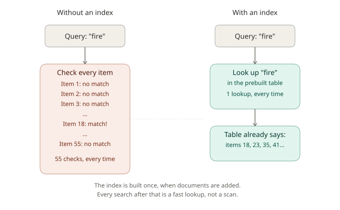
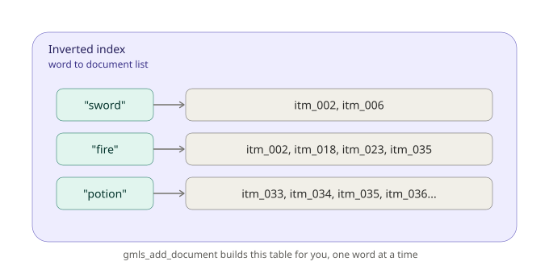

# Chapter 1: What Is a Search Engine, Anyway?

Welcome to GMLiteSearch! Before writing a single line of code, it's worth spending a few minutes on a question that sounds simple but has a surprisingly interesting answer: what does a search engine actually *do*, and why does your game need one instead of just checking if some text contains some other text?

This chapter is deliberately gentle. If you've never built or used a search system before, you're in exactly the right place. By the end, you'll have a working search index with real game items in it, and you'll understand what's happening under the hood well enough that everything in later chapters builds naturally on top of it.

## The problem: finding things in a pile of text

Imagine your game has an inventory system with 500 items. A player opens their inventory, types "flaming sword" into a search box, and expects to see the right item appear almost instantly.

How would you make that happen?

The most obvious approach: loop through all 500 items, and for each one, check whether its name or description contains the words the player typed. In GameMaker, that might look like calling `string_pos()` on every single item's text, one at a time, every time the player presses a key.

For 500 items, that's... probably fine, honestly. Computers are fast. But think about what happens as your game grows. What if you have 5,000 items? 50,000? What if this isn't just an inventory, but a quest log, an NPC dialogue database, and a crafting recipe list, all searchable at once? What if the player is typing, and you're re-running this check on every keystroke to update live suggestions?

Suddenly, "loop through everything and check" starts to feel expensive. Not because any single check is slow, but because you're doing the *same amount of work* every single time someone searches, regardless of how many times they've searched before. Nothing you learned from the last search helps you with the next one.

## The idea: build a shortcut ahead of time

Here's the trick that basically all search engines are built on, from GMLiteSearch to Google: instead of scanning everything at search time, do some preparation work *once*, when you first add your data. Then searching becomes fast, because you've already done the hard part in advance.

Think about the index at the back of a textbook. If you want to find every page that mentions "photosynthesis," you don't reread the entire book. You flip to the index, find "photosynthesis," and it already tells you: pages 42, 108, 156. Someone (or something) did the work of reading the whole book and noting where each important term appears, *before* you ever asked your question. Your lookup is now instant, no matter how long the book is.

A search engine builds something very similar for your game's text. It's called an **inverted index**, and the name makes more sense once you see it: instead of a normal index that goes "document → words it contains," an inverted index flips that around to go "word → documents that contain it." That flip is the whole trick.

Here's what that actually looks like:



On the left, without an index, every search means checking every item, one at a time, from scratch. On the right, with an index already built, a search for "fire" is a single lookup into a table that already knows the answer.

Here's what that table, the inverted index, actually contains, once GMLiteSearch has processed a handful of items:



Notice the shape: each word points to a list of item IDs. When you search for "fire," GMLiteSearch doesn't scan your 55 items, it looks up "fire" in this table and immediately knows the answer is items `itm_002`, `itm_018`, `itm_023`, and `itm_035`. That's the entire performance story of how search engines stay fast even with huge amounts of data: **do the expensive work once, when data is added, so that searching later is cheap.**

## One more idea: not all matches are equally good

There's a second concept worth planting here before we write any code, because it shapes almost everything else in this tutorial series.

Suppose a player searches "fire" and four items match: a fire-imbued staff, a fire resistance potion, dragon-scale armor that mentions fire resistance, and a flaming sword. Should all four appear in the exact same, arbitrary order? Probably not, some of these are *more about* fire than others. An item literally named "Staff of Arcane Fire" is probably a better match for "fire" than an armor piece that happens to mention fire resistance once in its description.

This is the idea of **relevance**: not just "does this match," but "how well does this match, and which result is the player most likely looking for." A good search engine doesn't just filter, it *ranks*. GMLiteSearch does this automatically for you using an algorithm called BM25, which we'll properly unpack in Chapter 3. For now, just know that when GMLiteSearch gives you back a list of results, that list is already sorted from most relevant to least relevant, and each result carries a `score` telling you exactly how relevant it is.

With those two ideas in place, indexing for speed, scoring for relevance, you're ready to build something real.

## Setting up your first index

Every GMLiteSearch project starts the same way: you tell it to initialize itself, add some documents, and then you can search. Let's do exactly that.

### Step 1: Initialize the engine

```gml
gmls_init();
```

This single line sets up everything GMLiteSearch needs internally: the inverted index table you just learned about, and several other subsystems we'll meet in later chapters (don't worry about those yet, they quietly initialize themselves and stay out of your way until you need them). Think of this as GMLiteSearch saying "I'm ready, hand me your data."

You'll typically call this once, early in your game, for example, in a controller object's Create event, or when your game boots up.

### Step 2: Understand what a "document" means here

Before we add anything, one quick clarification: in search terminology, a **document** doesn't necessarily mean a file. It means *any single unit of searchable content*. A game item is a document. So is an NPC's line of dialogue, a quest description, or a crafting recipe. Each one gets:

- A unique **ID** you choose (a string, a number, whatever makes sense for your game)
- The **text** that should be searchable
- Optional **metadata**, extra structured data about the document that isn't necessarily searched directly, but can be attached and retrieved later (we'll make heavier use of metadata starting in Chapter 2)

### Step 3: Add your items

For this chapter, we're going to work with a fantasy RPG's item database, 55 items spanning weapons, armor, potions, scrolls, and miscellaneous quest items. This is realistic in scale; a real game's item list often has far more than a handful of entries, and a tutorial that only ever searches through 4 items would teach you nothing about how search actually behaves.

Here's a representative slice of the dataset (the full 55-item array is longer, but this gives you the shape):

```gml
var items = [
    { id: "itm_001", name: "Iron Longsword", desc: "A sturdy iron longsword favored by town guards. Balanced and reliable, though nothing special." },
    { id: "itm_002", name: "Flametongue Blade", desc: "This enchanted sword bursts into flame when drawn, dealing extra fire damage to enemies." },
    { id: "itm_003", name: "Frostbite Rapier", desc: "A thin, quick blade infused with frost magic. Slows enemies on hit." },
    { id: "itm_004", name: "Rusty Shortsword", desc: "An old, worn shortsword. Better than nothing, but barely." },
    { id: "itm_005", name: "Dragonfang Katana", desc: "Forged from the fang of an ancient dragon, this katana cuts through armor with ease." },
    { id: "itm_006", name: "Silver Blessed Sword", desc: "A sword blessed by temple priests, silver-forged to be especially effective against undead creatures." },
    { id: "itm_018", name: "Staff of Arcane Fire", desc: "A wizard's staff imbued with raw fire magic, channeling powerful flame spells." },
    { id: "itm_023", name: "Dragonscale Chestplate", desc: "Armor crafted from the scales of a slain dragon, offering resistance to fire damage." },
    { id: "itm_033", name: "Minor Healing Potion", desc: "A small vial of red liquid that restores a modest amount of health when consumed." },
    { id: "itm_035", name: "Potion of Fire Resistance", desc: "This potion grants temporary resistance to fire damage, useful against dragons and flame enemies." },
    { id: "itm_041", name: "Scroll of Fireball", desc: "A magical scroll that, when read, unleashes a single powerful fireball spell." },
    { id: "itm_054", name: "Torch", desc: "A simple wooden torch, essential for lighting the way through dark caves and dungeons." },
    // ...43 more items in the full dataset, spanning weapons, armor, potions, scrolls, and misc items
];

for (var i = 0; i < array_length(items); i++) {
    gmls_add_document(items[i].id, items[i].name + ". " + items[i].desc);
}
```

A few things worth noticing here, because they're small decisions that matter:

**We combined the name and description into one text string.** `gmls_add_document` takes a single block of text to index, it doesn't inherently know that "Iron Longsword" is a title and the rest is a description. Right now, both are treated equally. In Chapter 2, you'll learn how to tell GMLiteSearch that titles deserve extra weight, which noticeably improves search quality. For now, simple and equal is exactly right for learning the basics.

**We used a struct array and a loop, not 55 individual function calls.** This isn't a GMLiteSearch requirement, it's just good practice. Real games load item data from structured sources (a struct array like this, a ds_grid, an external JSON file), not by hand-typing dozens of function calls. Get comfortable with this pattern now; you'll use it constantly.

**Each `id` is a string we chose ourselves** (`"itm_001"`, `"itm_002"`, and so on). GMLiteSearch doesn't generate IDs for you, you decide what makes sense. For items, a stable string ID like this is common. Later chapters will use other ID schemes depending on what's being indexed.

Run this, and GMLiteSearch silently builds its inverted index behind the scenes, the table you saw in the diagram above, now populated with real data from all 55 items.

## Your first search

Now for the payoff. Let's search for something.

```gml
var results = gmls_search("fire", -1);

show_debug_message("Found " + string(array_length(results)) + " results for 'fire':");
for (var i = 0; i < array_length(results); i++) {
    show_debug_message("  " + results[i].document.text + "  (score: " + string(results[i].score) + ")");
}
```

The second argument to `gmls_search`, `-1`, means "give me all matching results, don't cap the count." (You'll usually want a real limit in a shipped game, more on that in a moment.)

Run this against our 55-item dataset, and you'll see something like this (your exact score decimals may differ slightly depending on GameMaker's floating-point rounding, but the *ordering* and *which items match* will be consistent):

```
Found 5 results for 'fire':
  Staff of Arcane Fire. A wizard's staff imbued with raw fire magic...  (score: 1.40...)
  Potion of Fire Resistance. This potion grants temporary resistance to fire damage...  (score: 1.37...)
  Dragonscale Chestplate. Armor crafted from the scales of a slain dragon...  (score: 1.08...)
  Staff of Frozen Tides. This staff summons freezing water and ice, effective against fire-based enemies...  (score: 1.01...)
  Flametongue Blade. This enchanted sword bursts into flame when drawn...  (score: 0.98...)
```

Take a moment to actually look at this output, because there's real teaching value hiding in it.

Notice that **"Staff of Arcane Fire" ranks first**, even though "Potion of Fire Resistance" also mentions fire prominently. This is BM25's relevance scoring at work, items where "fire" makes up a larger share of a shorter, more focused piece of text tend to score higher than the same word appearing once inside a longer, more general description. We'll unpack exactly why in Chapter 3, but for now, just notice that the order isn't arbitrary. GMLiteSearch is doing real work to decide what "most relevant" means.

Also notice **"Staff of Frozen Tides" shows up**, even though at a glance it sounds like an ice-themed item, not a fire one. Look closer at its actual description: *"effective against fire-based enemies."* It genuinely does contain the word "fire", this is a real match, not a bug, and it's a good early lesson that text search finds what you actually wrote, not what you meant in spirit. If you don't want a counter-item like this surfacing for "fire" searches, that's a content and weighting decision you'll have more control over starting in Chapter 2.

### Understanding what you got back

Every element in the `results` array is a **struct**, and it's worth knowing exactly what's inside one, since you'll be reaching into these constantly:

| Field | What it is |
|---|---|
| `id` | The document ID you gave it when adding (e.g. `"itm_018"`) |
| `score` | A number representing relevance, higher means more relevant |
| `document` | The full stored document, including `.text` and `.metadata` |
| `matched_terms` | Which of your search words were actually found |
| `snippet` | A short auto-generated excerpt (we'll make much better use of this in Chapter 7) |

So `results[0].document.text` gets you the full indexed text of the top result, and `results[0].score` tells you exactly how relevant GMLiteSearch judged it to be. This struct shape is consistent across virtually every search function you'll learn in this tutorial series, learn it once here, and you'll recognize it everywhere.

## A word search isn't a substring search, and that matters

Here's a genuinely important, slightly non-obvious behavior worth understanding early, because it'll save you confusion later.

Try searching for "sword":

```gml
var results = gmls_search("sword", -1);
show_debug_message("Found " + string(array_length(results)) + " results for 'sword'");
```

You'll get exactly 2 results: **Flametongue Blade** and **Silver Blessed Sword**. If you were expecting "Iron Longsword" and "Rusty Shortsword" to show up too, since they visibly contain the letters s-w-o-r-d, here's why they don't.

GMLiteSearch doesn't search for "sword" as a chunk of characters buried inside a bigger word. It breaks text apart into individual **words** first (this process is called tokenization, and you'll hear that term again), and then searches among those whole words. "Longsword" and "Shortsword" are each a single, complete word to the tokenizer, not "long" plus "sword," and not "short" plus "sword." So a search for the standalone word "sword" correctly does *not* match them, the same way searching for "cat" in a library catalog shouldn't return every book with "catalog" in the title.

This is almost always what you want in practice, searching for "art" shouldn't return every result containing "cart," "party," or "smart", but it's worth knowing explicitly, since it explains behavior that might otherwise look like a bug.

## When nothing matches

Not every search finds something, and that's completely normal, your code needs to handle it gracefully. Try searching for something that doesn't exist in our dataset:

```gml
var results = gmls_search("excalibur", -1);
show_debug_message("Found " + string(array_length(results)) + " results");
```

This prints `Found 0 results`, and `results` is a perfectly valid, empty array, not `undefined`, not an error. This is a good habit to build from day one: always check `array_length(results) > 0` before assuming there's something at `results[0]`, whether you're showing a "no results found" message to the player or just defensively guarding your code.

```gml
var results = gmls_search("excalibur", -1);
if (array_length(results) > 0) {
    show_debug_message("Top match: " + results[0].document.text);
} else {
    show_debug_message("No items found matching that search.");
}
```

## Cleaning up

When you're done with a search index, say, your game is closing, or you're tearing down a menu system that used GMLiteSearch and won't need it again for a while, call:

```gml
gmls_cleanup();
```

This frees the internal data structures GMLiteSearch built (the inverted index and everything else), so you're not holding onto memory you no longer need. It's good practice to pair every `gmls_init()` with an eventual `gmls_cleanup()`, the same way you'd pair a `ds_map_create()` with a `ds_map_destroy()`.

## What you've learned

Let's recap, because this chapter covered more conceptual ground than it might have felt like:

- **Why search engines exist**: checking every document one by one gets slow as your data grows, because you repeat the same work on every single search.
- **The inverted index**: the core trick that makes search fast, build a word-to-document lookup table once, when data is added, so searching later is just a fast lookup instead of a scan.
- **Relevance and scoring**: search results aren't just "match or no match", GMLiteSearch ranks them by how well they match, using a score.
- **The practical basics**: `gmls_init()` to start, `gmls_add_document()` to index content, `gmls_search()` to find it, `gmls_cleanup()` to tear down.
- **Word-based matching**: search operates on whole words, not substrings, "sword" won't match "Longsword," and that's usually exactly what you want.
- **Defensive habits**: search can return zero results, and that's a normal, valid outcome your code should expect.

## What's next

Right now, every item in our index is treated identically, GMLiteSearch has no idea that "Flametongue Blade" is a *name* and "This enchanted sword bursts into flame when drawn..." is a *description*. Intuitively, though, if a player searches for something, a match in the item's actual name probably matters more than a match buried in the middle of a long description.

In **Chapter 2**, we'll fix that. You'll learn how to structure documents properly using metadata, how to make titles carry more search weight than body text, and how to manage a document's lifecycle, updating, removing, and inspecting what's actually in your index. We'll also grow our dataset further and start treating it the way a real game's content pipeline would.

See you there.
