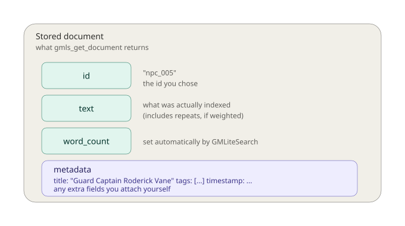
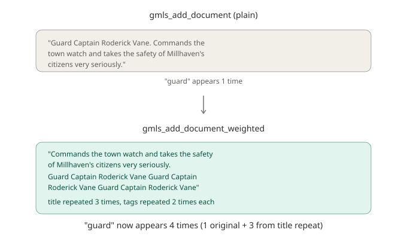
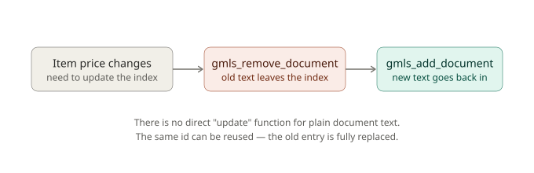

# Chapter 2: Documents, Metadata, and Why Structure Matters

In Chapter 1, you built a working search index and learned the core ideas behind how search engines work: the inverted index that makes lookups fast, and the scoring system that ranks results by relevance. But we treated every document the same way, a name and a description, mashed together into one flat block of text, with no distinction between them.

That's a fine starting point, but it leaves real quality on the table. In this chapter, you'll learn how to structure documents properly: what metadata is and why it exists, how to make certain parts of a document count more than others during search, and the full lifecycle of a document from creation through removal. Along the way, we'll dig into a mechanism that's more interesting than it first appears, GMLiteSearch doesn't have a hidden "title importance" setting somewhere. It achieves title weighting through a much simpler and more transparent trick, and understanding that trick will make you meaningfully better at reasoning about your own search results later.

## A new dataset: the village of Millhaven

For this chapter, we're leaving weapons and potions behind. Instead, we'll build a searchable directory of NPCs living in a small fantasy village called Millhaven, 65 characters in total, spanning shopkeepers, guards, farmers, scholars, and a fair number of eccentric side characters. This is a genuinely useful thing to search in a real game: think of a quest log that lets players search "who sells potions" or a journal feature that surfaces "which NPC mentioned the mine."

A representative slice of the dataset looks like this:

```gml
var npcs = [
    { id: "npc_001", name: "Elder Marta Stonewell", role: "Village Elder", desc: "The wise leader of Millhaven, known for her fair judgment and deep knowledge of local history." },
    { id: "npc_002", name: "Blacksmith Gareth Ironforge", role: "Blacksmith", desc: "A burly craftsman who forges weapons and armor at the village smithy near the town square." },
    { id: "npc_003", name: "Innkeeper Wilhelmina Brew", role: "Innkeeper", desc: "Runs the Sleeping Dragon Inn, offering rooms, meals, and the latest town gossip." },
    { id: "npc_005", name: "Guard Captain Roderick Vane", role: "Guard Captain", desc: "Commands the town watch and takes the safety of Millhaven's citizens very seriously." },
    { id: "npc_010", name: "Scholar Delphine Ashgrove", role: "Scholar", desc: "Studies ancient texts and ruins, often seeking adventurers to retrieve lost artifacts." },
    { id: "npc_060", name: "Village Watchman Fenwick Bell", role: "Watchman", desc: "Patrols the streets at night alongside the guard captain, keeping an eye out for trouble." },
    { id: "npc_065", name: "Retired Guard Marta Stillwater", role: "Retired Guard", desc: "Once served under the guard captain, now spends her days tending a small garden." },
    // ...58 more villagers in the full dataset
];
```

Notice something deliberate here: this village has **two different people named Marta** (`npc_001`, the Village Elder, and `npc_065`, a retired guard), and **several NPCs whose descriptions mention "guard captain"** even though only one of them (`npc_005`) actually *is* the guard captain. This overlap isn't an accident, it's exactly the kind of realistic messiness that makes the concepts in this chapter worth learning. A tiny, perfectly clean dataset would never expose why structure matters.

## What "metadata" actually is

Back in Chapter 1, we mentioned that `gmls_add_document` accepts an optional third argument called metadata, but we didn't use it. Let's fix that now.

Metadata is **structured information about a document that sits alongside the searchable text**, rather than being part of it. Think of it as the difference between a book's *contents* and its *catalog card*: the contents are what you search through, but the catalog card holds structured facts, author, publication year, genre, that help you organize, filter, and describe the book without needing to reread it.

In GMLiteSearch, metadata is just a GML struct you attach to a document. If you don't provide one, GMLiteSearch quietly creates a sensible default for you:

```gml
// If you don't pass metadata, GMLiteSearch creates this automatically:
{ title: "", tags: [], timestamp: current_time }
```

You're not limited to those three fields, though, metadata is genuinely just "whatever struct you want to attach." You could add an `author` field, a `rarity` field, a `location` field, anything relevant to your game. GMLiteSearch will happily carry it along and hand it back to you in every search result via `results[i].document.metadata`.

Here's the full anatomy of what actually gets stored for every document you add:



Two fields are worth calling out specifically:

- **`text`** is exactly what got indexed and searched, and as you're about to see, this isn't always identical to what you originally typed.
- **`word_count`** is calculated automatically by GMLiteSearch after indexing. You never set this yourself; it's there for you to read (we'll use it directly in a moment).

## Indexing with metadata, the plain way

Let's start simple: add our NPCs using regular `gmls_add_document`, but this time actually populate the metadata:

```gml
gmls_init();

var npcs = [
    { id: "npc_001", name: "Elder Marta Stonewell", role: "Village Elder", desc: "The wise leader of Millhaven, known for her fair judgment and deep knowledge of local history." },
    { id: "npc_002", name: "Blacksmith Gareth Ironforge", role: "Blacksmith", desc: "A burly craftsman who forges weapons and armor at the village smithy near the town square." },
    // ...all 65 NPCs
];

for (var i = 0; i < array_length(npcs); i++) {
    var npc = npcs[i];
    var searchable_text = npc.name + ". " + npc.desc;
    var metadata = { title: npc.name, tags: [npc.role], timestamp: current_time };
    gmls_add_document(npc.id, searchable_text, metadata);
}
```

We're still concatenating the name into the searchable text by hand (`npc.name + ". " + npc.desc`), the same way we did in Chapter 1, but now we're *also* storing the name properly in `metadata.title`, and the NPC's role as a tag. Right now, that metadata isn't affecting search at all; it's just being carried along for the ride, ready to be displayed or filtered on later.

Try a search:

```gml
var results = gmls_search("guard", -1);
for (var i = 0; i < array_length(results); i++) {
    show_debug_message(results[i].document.metadata.title + " (score: " + string(results[i].score) + ")");
}
```

You'll see something like this (again, exact decimals may vary slightly by engine, but the relative shape holds):

```
Retired Guard Marta Stillwater (score: 0.293)
Guard Captain Roderick Vane (score: 0.229)
Village Watchman Fenwick Bell (score: 0.222)
```

This actually looks pretty reasonable already, both real "guards" outrank the watchman who only *mentions* a guard captain in passing. But look closely at the gap between them: 0.293, 0.229, 0.222. That's a fairly tight cluster. In a small example like this, it happens to work out. But in a larger, messier dataset, imagine hundreds of NPCs, many of them mentioning "the guard captain" in their dialogue or backstory, that thin margin becomes a real liability. A single extra mention of "guard" in some unrelated NPC's flavor text could be enough to nudge them above someone whose actual *job* is being a guard.

This is exactly the problem title-weighting exists to solve.

## Introducing `gmls_add_document_weighted`

GMLiteSearch offers a second way to add documents, one designed specifically to make titles and tags carry more relevance weight than the same words appearing incidentally in body text:

```gml
gmls_add_document_weighted(id, text, metadata);
```

The signature looks identical to `gmls_add_document`, same three parameters, but the metadata argument is no longer just along for the ride. This time, `metadata.title` and `metadata.tags` actively shape what gets indexed.

Here's the important part, and it's worth understanding precisely rather than just trusting that "it works": **`gmls_add_document_weighted` does not apply some hidden scoring multiplier at search time.** Instead, it does something much more direct, it repeats the title **3 times** and each tag **2 times**, and stitches those repetitions directly onto the end of your body text, *before* that combined string ever gets indexed. The weighting happens by changing what text gets searched, not by changing how search itself works.

Here's exactly what that transformation looks like for Roderick, our guard captain:



Notice: the word "guard" originally appeared once in Roderick's indexed text (inside his title, mentioned a single time). After weighting, because his title, "Guard Captain Roderick Vane", gets repeated three times, "guard" now appears **four times total** in his indexed text. Every word in the title benefits from this same repetition, not just the one you happen to be thinking about.

### Rewriting our indexing with weighting

```gml
gmls_init();

for (var i = 0; i < array_length(npcs); i++) {
    var npc = npcs[i];
    var metadata = { title: npc.name, tags: [npc.role], timestamp: current_time };
    gmls_add_document_weighted(npc.id, npc.desc, metadata);
}
```

Notice the second argument is now just `npc.desc`, **not** `npc.name + ". " + npc.desc` like before. We don't need to manually concatenate the name into the body text anymore, because `gmls_add_document_weighted` handles pulling the title in itself, straight from `metadata.title`. This is a meaningfully cleaner pattern: your body text and your title stay conceptually separate in your own code, and GMLiteSearch handles combining them with the appropriate weighting.

Run the same "guard" search again:

```gml
var results = gmls_search("guard", -1);
for (var i = 0; i < array_length(results); i++) {
    show_debug_message(results[i].document.metadata.title + " (score: " + string(results[i].score) + ")");
}
```

```
Retired Guard Marta Stillwater (score: 0.367)
Guard Captain Roderick Vane (score: 0.349)
Village Watchman Fenwick Bell (score: 0.218)
```

Compare the gaps carefully. Before weighting: 0.293 → 0.229 → 0.222 (a difference of 0.071 between 1st and 3rd place). After weighting: 0.367 → 0.349 → 0.218 (a difference of 0.149 between 1st and 3rd place, roughly double the separation). The two genuine title-holders are now much more clearly and robustly ahead of the NPC who only mentions "guard" in passing, while Fenwick himself barely moved (0.222 → 0.218), since nothing about *his own* title repeats the word "guard."

That's the real, honest value of weighted indexing: it doesn't necessarily flip result order on every query (sometimes plain search already gets it right, as it did here), it makes correct rankings **more robust**, widening the margin between genuine title matches and coincidental body-text mentions, so that a larger, messier real-world dataset is less likely to accidentally scramble your results.

### An interesting side effect: weighted documents are "longer"

There's a subtlety worth knowing about, because it's the kind of thing that looks like a bug the first time you notice it if nobody's told you about it. Compare word counts:

```gml
gmls_init();

gmls_add_document("plain_test", "Guard Captain Roderick Vane. Commands the town watch and takes the safety of Millhaven's citizens very seriously.");
var plain_doc = gmls_get_document("plain_test");
show_debug_message("Plain word count: " + string(plain_doc.word_count));

gmls_add_document_weighted("weighted_test", "Commands the town watch and takes the safety of Millhaven's citizens very seriously.", { title: "Guard Captain Roderick Vane", tags: [], timestamp: current_time });
var weighted_doc = gmls_get_document("weighted_test");
show_debug_message("Weighted word count: " + string(weighted_doc.word_count));
```

You'll see the weighted version reports a noticeably higher word count than the plain version, even though they describe the exact same person with the exact same underlying information. This happens because the repeated title words are, from the indexer's point of view, just more words in the document. This isn't a problem, BM25 (the scoring algorithm from Chapter 1) accounts for document length as part of its formula, balancing "how often does this word appear" against "how long is this document overall." But it's worth knowing this is happening under the hood, rather than being surprised by it later when you're inspecting index statistics.

### `gmls_add_document_enhanced`, the same thing, a friendlier name

You may also come across `gmls_add_document_enhanced`. This is simply an alias, it calls `gmls_add_document_weighted` internally and behaves identically. Use whichever name reads better in your own code; there's no functional difference.

```gml
// These two lines do exactly the same thing:
gmls_add_document_weighted("npc_005", desc, metadata);
gmls_add_document_enhanced("npc_005", desc, metadata);
```

## When should you use weighted indexing?

Given everything above, a reasonable question is: why wouldn't you *always* use `gmls_add_document_weighted`? In practice, there's rarely a reason not to, if your documents naturally have a meaningful title. The main case where plain `gmls_add_document` still makes sense is when your content genuinely has no clear "title" concept, a raw log of freeform player chat messages, for instance, where every message is equally just... text, with nothing that deserves extra emphasis.

For anything with a clear name, heading, or short label, items, NPCs, quests, locations, weighted indexing is almost always the better default.

## Removing documents

Content changes. An NPC might leave the village, a limited-time quest might expire, a shop's inventory might rotate. GMLiteSearch makes removing a document from the index straightforward:

```gml
gmls_remove_document("npc_065");
```

This returns `true` if the document existed and was removed, or `false` if no document with that ID was found, worth checking if you want to confirm the removal actually did something:

```gml
var removed = gmls_remove_document("npc_099");  // doesn't exist in our dataset
show_debug_message("Removed: " + string(removed));  // prints: Removed: 0
```

Behind the scenes, removing a document does real cleanup work: it goes through every word that document contributed to the inverted index and decrements the counts, fully deleting a word's entry from the index entirely if this was the last document containing it. This keeps your index accurate, searching after a removal won't surface stale references to a document that's no longer there.

```gml
gmls_init();
gmls_add_document("temp_npc", "A mysterious traveling merchant selling rare gemstones.");

var before = gmls_search("gemstones", -1);
show_debug_message("Before removal: " + string(array_length(before)) + " results");

gmls_remove_document("temp_npc");

var after = gmls_search("gemstones", -1);
show_debug_message("After removal: " + string(array_length(after)) + " results");
```

```
Before removal: 1 results
After removal: 0 results
```

## Retrieving a single document

Sometimes you don't want to search, you already know exactly which document you want, by ID, and just want to fetch it directly. That's what `gmls_get_document` is for:

```gml
var npc = gmls_get_document("npc_005");
if (npc != undefined) {
    show_debug_message("Found: " + npc.metadata.title);
    show_debug_message("Text: " + npc.text);
    show_debug_message("Word count: " + string(npc.word_count));
} else {
    show_debug_message("No document with that ID exists.");
}
```

Just like `gmls_search`, this can come back empty, specifically, it returns `undefined` if no document with that ID exists, so the same defensive-checking habit from Chapter 1 applies here too. This function does not perform any text matching or scoring; it's a direct lookup by exact ID, closer to reading a value out of a dictionary than performing a search.

## There is no "update" function, and that's fine

Here's something worth stating clearly, because you might otherwise go looking for a function that doesn't exist: **GMLiteSearch has no built-in way to directly edit a document's text or metadata in place.** There's no `gmls_update_document()`.

At first, that might sound like a missing feature. In practice, the fix is simple and turns out to be the correct pattern anyway: **remove the document, then add it again** with the same ID and the new content.



```gml
function update_npc_description(npc_id, new_desc, new_title, new_tags) {
    gmls_remove_document(npc_id);
    var metadata = { title: new_title, tags: new_tags, timestamp: current_time };
    gmls_add_document_weighted(npc_id, new_desc, metadata);
}

// Example: Roderick gets promoted
update_npc_description(
    "npc_005",
    "Newly appointed as head of the entire Millhaven militia, overseeing all town defenses.",
    "Militia Commander Roderick Vane",
    ["Militia Commander"]
);
```

Because you're reusing the exact same ID, this feels like an update from the outside, anyone holding onto `"npc_005"` as a reference still finds the right person, just with fresh information. Internally, though, it's a clean removal followed by a clean insertion, which means the index never ends up in some half-updated, inconsistent state. This is a genuinely common pattern across search systems in general, not just something specific to GMLiteSearch, "delete and reinsert" is often simpler and more reliable than trying to surgically patch an existing index entry.

## Inspecting your index: `gmls_get_stats()`

As your index grows, it's useful to be able to check its overall shape without manually counting anything yourself. `gmls_get_stats()` gives you a quick snapshot:

```gml
var stats = gmls_get_stats();
show_debug_message("Documents indexed: " + string(stats.document_count));
show_debug_message("Unique words: " + string(stats.unique_words));
show_debug_message("Total word occurrences: " + string(stats.total_word_occurrences));
show_debug_message("Stemming enabled: " + string(stats.stemming_enabled));
```

Running this after indexing all 65 Millhaven NPCs with weighted indexing gives you a real sense of scale, dozens of unique words, hundreds of total word occurrences once you account for title repetition. This is a genuinely useful sanity check during development: if you expected `document_count` to be 65 and it's showing 64, that's an immediate signal something didn't get added correctly, worth investigating before you move on. We'll make heavier use of `gmls_get_stats()` and its more detailed cousins in Chapter 10, when we cover developer tools for debugging and validating a production search setup.

## What you've learned

- **Metadata** is structured information attached to a document, separate from the searchable text, that you can use to store titles, tags, timestamps, or anything else relevant to your game.
- **`gmls_add_document_weighted`** makes titles and tags count more during search, and it does this through a specific, transparent mechanism: repeating the title 3 times and each tag 2 times directly into the indexed text, not through a hidden scoring multiplier.
- This repetition has a real, honest tradeoff: weighted documents become "longer" in the index, which interacts with BM25's length normalization, a detail worth understanding rather than being surprised by.
- Weighting's practical benefit is **robustness**, not magic, it widens the margin between genuine title matches and coincidental mentions, which matters most as your dataset grows and messier overlaps become more common.
- **`gmls_remove_document`** cleanly removes a document and correctly cleans up the inverted index behind it.
- **`gmls_get_document`** retrieves one document directly by ID, no scoring involved.
- There's **no direct update function**, the correct, standard pattern is remove-then-re-add using the same ID.
- **`gmls_get_stats()`** gives you a quick snapshot of your index's overall size and configuration.

## What's next

So far, every search we've run has been an exact word match, if you don't type a word correctly, GMLiteSearch won't find it. Real players make typos constantly, and a search box that breaks on the first misspelling feels frustrating fast.

In **Chapter 3**, we'll fix that. You'll learn what "fuzzy" matching actually means under the hood, how autocomplete-style prefix search works, and how to make GMLiteSearch forgiving of the way people actually type. We'll also grow into a genuinely large, more varied dataset, a full shop inventory across several vendor types, to properly stress-test how these forgiving search modes behave at scale.

See you there.
