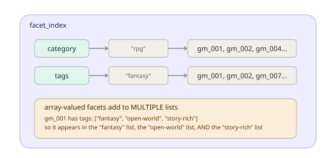
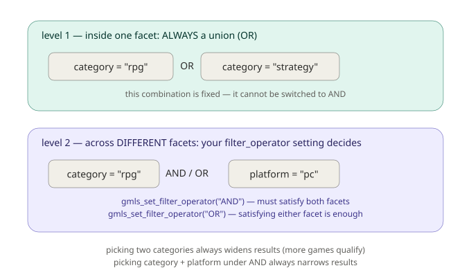
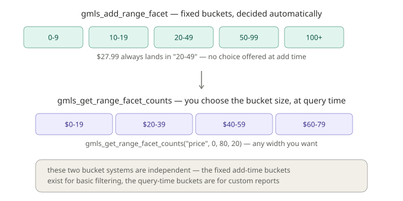

# Chapter 4: Filtering, Faceted Search Explained

Everything we've built so far has revolved around one question: does this document's *text* match what the player typed? Chapters 1 through 3 gave us increasingly sophisticated ways to answer that question, exact matching, weighted titles, typo tolerance. But there's a whole category of "finding the right thing" that has nothing to do with matching words at all.

Think about the last time you shopped online. You probably didn't type a perfect search query and get exactly what you wanted on the first try. More likely, you searched for something general, and then used a sidebar full of checkboxes to narrow things down, price range, brand, size, category, customer rating. You were **filtering**, not searching, and the two are genuinely different operations that happen to work beautifully together.

This chapter introduces **faceted search**, the capability that makes that sidebar-of-checkboxes experience possible. We'll also cover something that trips people up surprisingly often: what happens when you select more than one filter at once, and the specific, precise way GMLiteSearch decides which documents survive multiple simultaneous filters.

## What is a "facet," exactly?

The term "facet" comes from library science, of all places, and it's a genuinely useful concept once you see it clearly. A facet is a **structured category or attribute** that a document has, not part of its free-flowing text, but a discrete, classifiable property. If you were organizing a physical library, "fiction vs. non-fiction" is a facet. So is "publication decade." So is "author's country of origin." None of these are things you'd find by searching the book's actual sentences, they're metadata *about* the book, chosen specifically because they're useful ways to slice up a large collection.

For a game marketplace, which is exactly what we'll be building in this chapter, natural facets include: what **category** a game belongs to (RPG, action, strategy...), what **tags** describe it (fantasy, multiplayer, cozy...), what **platform** it runs on, and its **price**. None of these require reading a single word of the game's description. They're structured facts you already know when you add the game to your catalog.

## A new dataset: the game marketplace

For this chapter, we're building a proper game storefront, 75 games spanning nine categories, three platforms, and a real spread of prices. This dataset is deliberately richer than previous chapters', because faceted search only becomes interesting once there's enough overlapping structure to actually filter through.

A representative slice:

```gml
var games = [
    { id: "gm_001", name: "Dragon's Reckoning", desc: "Epic open-world RPG with dragon companions and a branching story.", category: "rpg", tags: ["fantasy", "open-world", "story-rich"], platform: "pc", price: 59.99 },
    { id: "gm_009", name: "Neon Vendetta", desc: "Fast-paced cyberpunk shooter with wall-running and slow-motion combat.", category: "action", tags: ["cyberpunk", "shooter", "fast-paced"], platform: "pc", price: 49.99 },
    { id: "gm_016", name: "Empire of Ash", desc: "Grand strategy game spanning centuries of conquest and diplomacy.", category: "strategy", tags: ["4x", "historical", "diplomacy"], platform: "pc", price: 49.99 },
    { id: "gm_007", name: "Mistveil Tactics", desc: "Turn-based tactical RPG set in a cursed, fog-covered kingdom.", category: "rpg", tags: ["tactical", "fantasy", "turn-based"], platform: "mobile", price: 9.99 },
    // ...71 more games in the full dataset, see Chapter4_Dataset.gml
];
```

The full dataset lives in `Chapter4_Dataset.gml`, alongside this chapter, and includes every game we'll reference. In total: 14 RPGs, 11 strategy games, 10 action games, 9 adventure games, 7 puzzle games, 7 simulation games, 6 racing games, 6 horror games, and 5 party games, spread across pc, console, and mobile, with prices ranging from $2.99 to $59.99.

## Indexing with facets: `gmls_add_document_faceted`

Adding a document with facet data uses a new function:

```gml
gmls_add_document_faceted(id, text, facets, metadata);
```

Notice this takes **four** arguments now, a `facets` struct is inserted between the text and the metadata. Here's how we'd index our full catalog:

```gml
gmls_init();

for (var i = 0; i < array_length(games); i++) {
    var g = games[i];
    var facets = {
        category: g.category,
        tags: g.tags,
        platform: g.platform,
        price: g.price
    };
    var metadata = { title: g.name, tags: g.tags, timestamp: current_time };
    gmls_add_document_faceted(g.id, g.desc, facets, metadata);
}
```

Worth knowing explicitly: **`gmls_add_document_faceted` calls `gmls_add_document_weighted` internally.** You're not choosing between "faceted indexing" and "weighted indexing", faceted documents automatically get the title-weighting benefits from Chapter 2 as well. Facets are additive on top of everything you already know, not a separate system you have to reason about independently.

### What actually happens to your facet data

When you pass a `facets` struct, GMLiteSearch builds a lookup structure, for every facet name, it maintains a table mapping each possible value to the list of document IDs that have it:



There's a genuinely important detail buried in that diagram, worth calling out directly: **when a facet's value is an array, like our `tags` field, the document gets added to the list for *every single value* in that array**, not just one. `gm_001`'s tags are `["fantasy", "open-world", "story-rich"]`, so it shows up under all three, simultaneously. This is exactly what lets a single game belong to multiple overlapping categories of description at once, a game can be both "fantasy" and "cozy" and "multiplayer," and a player filtering by any one of those tags will correctly find it.

## Basic filtering

Let's actually filter something. Suppose a player wants to see only RPGs:

```gml
gmls_add_facet_filter("category", "rpg");

var results = gmls_search_faceted("", -1, ["category"]);
show_debug_message("Total RPGs: " + string(results.total));
```

`gmls_add_facet_filter` registers an active filter, it doesn't search anything by itself, it just adds a condition that subsequent faceted searches will respect. `gmls_search_faceted` is the function that actually applies your active filters (and, as we'll see shortly, can combine filtering with real text search too).

Run this against our full catalog, and `results.total` correctly reports **14**, matching the real count of RPGs in our dataset.

You can remove a specific filter, or clear everything at once:

```gml
gmls_remove_facet_filter("category", "rpg");  // removes just this one
gmls_clear_facet_filters();                    // removes everything active
```

And at any point, you can inspect what's currently active:

```gml
var active = gmls_get_active_filters();
// active is a struct like: { category: ["rpg"] }
```

## Counting before filtering: `gmls_get_facet_counts`

Before a player commits to a filter, it's usually good UX to show them *how many* results each option would produce, think of the little numbers next to each checkbox in a typical shopping sidebar ("RPG (14)", "Action (10)"...). `gmls_get_facet_counts` gives you exactly that, without actually applying any filter:

```gml
var counts = gmls_get_facet_counts("", undefined, ["category"]);
var category_counts = counts[$ "category"];
var category_names = variable_struct_get_names(category_counts);
for (var i = 0; i < array_length(category_names); i++) {
    var name = category_names[i];
    show_debug_message(name + ": " + string(category_counts[$ name]));
}
```

This prints every category alongside its real count, `rpg: 14`, `action: 10`, `strategy: 11`, and so on for all nine categories. One detail worth knowing: **this only returns values that actually have at least one match.** If you had a `category` value with zero current matches (say, everything in that category got removed), it simply wouldn't appear in the results at all, you won't get a phantom `weird_category: 0` entry to filter out yourself.

## The part that trips people up: multiple filters at once

Here's where faceted search gets genuinely interesting, and where a slightly imprecise mental model can lead you astray. What happens when a player selects **more than one filter simultaneously**, say, category AND platform, or two different tags at once?

The honest answer requires understanding that GMLiteSearch's filtering logic actually operates on **two separate levels**, and they behave differently.



### Level 1: multiple values within the SAME facet are always OR'd together

If you select two different values for the *same* facet, say, both "rpg" and "strategy" as category filters, GMLiteSearch always treats this as "either one is fine." This isn't configurable; it's baked into how the filtering works:

```gml
gmls_clear_facet_filters();
gmls_add_facet_filter("category", "rpg");
gmls_add_facet_filter("category", "strategy");

var results = gmls_search_faceted("", -1, ["category"]);
show_debug_message("RPG or Strategy: " + string(results.total));
```

This correctly returns **25** games (14 RPGs + 11 strategy games, since these categories don't overlap). Selecting a second value within the same facet always *widens* your results, you're saying "show me more kinds of things I'd accept," not "narrow this down further."

### Level 2: DIFFERENT facets combine according to `gmls_set_filter_operator`

Filtering by two genuinely different facets, say, category AND platform, is where the AND/OR choice actually matters, and it's controlled by a global setting:

```gml
gmls_set_filter_operator(operator);  // "AND" or "OR"
```

Let's see both in action, filtering by `category = "rpg"` and `platform = "pc"`:

```gml
gmls_clear_facet_filters();
gmls_add_facet_filter("category", "rpg");
gmls_add_facet_filter("platform", "pc");

gmls_set_filter_operator("AND");
var and_results = gmls_search_faceted("", -1, undefined);
show_debug_message("RPG AND pc: " + string(and_results.total));

gmls_set_filter_operator("OR");
var or_results = gmls_search_faceted("", -1, undefined);
show_debug_message("RPG OR pc: " + string(or_results.total));
```

```
RPG AND pc: 8
RPG OR pc: 16
```

Under `"AND"`, only games that are *both* an RPG *and* on PC survive, 8 games. Under `"OR"`, anything that's *either* an RPG *or* on PC (or both) passes, a broader set of 16 games. This is exactly the behavior you'd expect from a general-purpose filter UI: checking "RPG" and "PC" as separate filter groups typically means "narrow to games that satisfy both," which is `"AND"`, GMLiteSearch's default.

**The critical thing to internalize**: your `filter_operator` setting has zero effect on how multiple values *within one facet* combine, those are always OR'd. It only governs how entirely *different* facets relate to each other. Mixing these two levels up in your head is the single easiest way to misjudge how a multi-filter search will actually behave, so it's worth re-reading this section slowly if any part of it felt fast.

## Filtering by tags

Tags work exactly like any other facet, the only difference is that a game typically has several tags at once (since `tags` is stored as an array), so filtering by a tag naturally tends to be a "does this game have this tag among its several" check:

```gml
gmls_clear_facet_filters();
gmls_add_facet_filter("tags", "fantasy");

var results = gmls_search_faceted("", -1, undefined);
show_debug_message("Fantasy-tagged games: " + string(results.total));
```

This correctly returns **9** games, every game whose tags array includes "fantasy," regardless of what category it's actually filed under (worth noting: all 9 in our dataset happen to be RPGs, since that's simply how we tagged this particular dataset, but nothing about the mechanism itself restricts fantasy-tagged games to any one category).

## Combining facets with real text search

Everything above used an empty query string (`""`), meaning "match everything, then filter." But faceted search's real power shows up when you combine it with the text search techniques from Chapters 1 through 3:

```gml
gmls_clear_facet_filters();
gmls_add_facet_filter("category", "action");

var results = gmls_search_faceted("fast-paced combat", -1, ["category"]);
for (var i = 0; i < array_length(results.results); i++) {
    show_debug_message(results.results[i].document.metadata.title);
}
```

This finds action games whose *text* relates to "fast-paced combat," narrowed to only the action category, text relevance and structured filtering, working together in one call. This is exactly the pattern behind a real storefront's search box: someone might type "cozy farming" while also having "Simulation" checked in the sidebar, and they expect both constraints to apply simultaneously.

## Price ranges: two different bucketing systems

Numeric values like price don't fit neatly into a simple "value equals value" facet, a $27.99 game and a $29.99 game are similar prices, but they're not *equal*, so they wouldn't naturally group together the way "rpg equals rpg" does. GMLiteSearch handles this with **range facets**, and there's a genuinely important detail worth understanding clearly: **there are actually two separate, independent bucketing systems at play, not one.**



### System 1: `gmls_add_range_facet`, fixed buckets, decided for you

```gml
gmls_add_range_facet(g.id, "price", g.price);
```

When you add a range facet, GMLiteSearch automatically sorts the numeric value into one of five **fixed** buckets: `0-9`, `10-19`, `20-49`, `50-99`, or `100+`. You don't get to choose this bucketing at add-time, it's a built-in scheme. A $27.99 game always lands in "20-49." This gives you basic price-tier filtering essentially for free, using the same `gmls_add_facet_filter("price", "20-49")` mechanism as any other facet, since under the hood it's stored exactly the same way.

### System 2: `gmls_get_range_facet_counts`, flexible buckets, chosen by you, at query time

```gml
var price_buckets = gmls_get_range_facet_counts("price", 0, 60, 20);
var bucket_names = variable_struct_get_names(price_buckets);
for (var i = 0; i < array_length(bucket_names); i++) {
    show_debug_message(bucket_names[i] + ": " + string(price_buckets[$ bucket_names[i]]) + " games");
}
```

This is a **completely separate** bucketing operation, here, *you* specify the minimum, maximum, and bucket width (`0` to `60` in steps of `20`, in this example), and GMLiteSearch counts documents into whatever buckets that produces (`"0-20"`, `"20-40"`, `"40-60"`). This is meant for building custom reports or price-range sliders where you want control over the exact breakdown, independent of the fixed five-tier system used for basic filtering.

The key thing to keep straight: **these two systems don't talk to each other.** The fixed buckets from `gmls_add_range_facet` exist permanently as part of your facet index, usable for filtering. The flexible buckets from `gmls_get_range_facet_counts` are computed fresh, on demand, purely for reporting, they don't create new filterable facet values, they just tell you counts for whatever bucket scheme you asked about in that specific call.

## What you've learned

- **Facets** are structured, categorical attributes of a document, distinct from searchable text, used for filtering and organizing large collections.
- **`gmls_add_document_faceted`** indexes a document with facet data, and automatically applies weighted indexing underneath, building on everything from Chapter 2.
- **Array-valued facets** (like tags) add a document to multiple value lists simultaneously, one document, several facet memberships at once.
- **`gmls_get_facet_counts`** shows how many documents match each facet value, without actually filtering, useful for building filter UIs with live counts, and it only ever returns values with at least one real match.
- **Filtering has two distinct levels**: multiple values *within* one facet are always combined with OR (never configurable), while *different* facets combine according to your `gmls_set_filter_operator` setting (`"AND"` narrows, `"OR"` widens).
- **`gmls_search_faceted`** combines structured filtering with real text search in a single call.
- **Range facets have two independent bucketing systems**: a fixed, automatic scheme used at add-time for basic filtering, and a flexible, caller-controlled scheme computed at query-time purely for reporting.

## What's next

We've covered filtering by category, tags, platform, and price, but there's one more genuinely common filtering need we haven't touched: **time**. "Show me games released this month," "sort by newest," "what's trending this week", these are all facet-style questions, but ones specifically about dates, which come with their own particular challenges (what does "this month" even mean as a precise boundary? how do you efficiently ask "is this date within this range?").

In **Chapter 5**, we'll extend everything we just learned specifically to dates, date facets, date range filtering with both explicit ranges and convenient presets like "last 30 days," and date histograms for visualizing how a collection is distributed over time. We'll build on this same 75-game marketplace, adding release dates to make the temporal filtering genuinely meaningful.

See you there.
