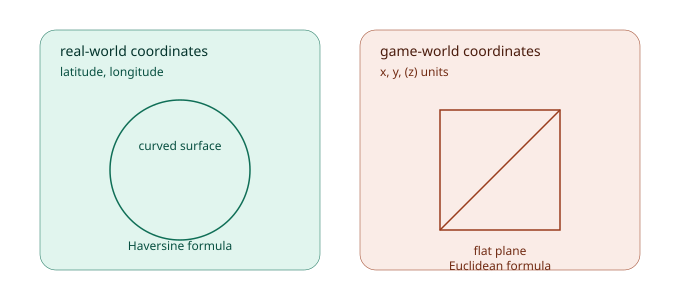
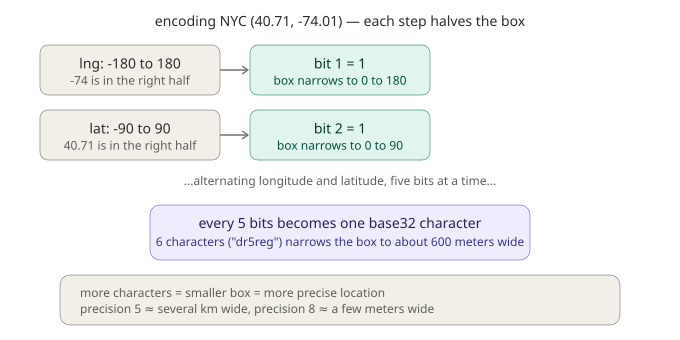
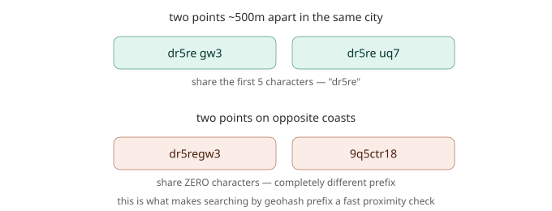
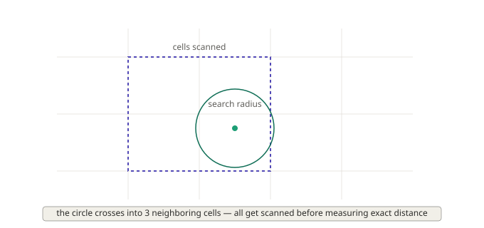

# Chapter 6: Location-Aware Search, Geospatial Concepts

Every filter we've built so far, category, tags, platform, price, release date, has been about *what a thing is*. This chapter is about something entirely different: *where a thing is*. "What shops are near me?" "Which NPCs are within earshot?" "What's the closest quest marker?" These are spatial questions, and answering them requires genuinely different tools than anything we've covered so far, not because GMLiteSearch's designers wanted to make your life harder, but because "near" is a surprisingly rich concept once you actually try to compute it.

This is a long chapter, and deliberately so, geospatial search covers real mathematical ground (spherical geometry, coordinate systems, spatial indexing structures), and glossing over the *why* behind each piece would leave you with commands to copy but no real understanding of when to reach for which one. By the end, you'll understand two entirely different coordinate systems, three different ways to search by proximity, and a genuinely elegant indexing trick called geohashing that makes proximity search fast even across huge datasets.

## Two different kinds of "location"

Before any code, it's worth being precise about something that's easy to blur together: GMLiteSearch actually supports **two fundamentally different coordinate systems**, and they are not interchangeable.

**Real-world coordinates** are latitude and longitude, the system used by GPS, maps, and anything tied to actual physical geography on Earth. If you're building a location-based mobile game where players interact with real places, this is what you'd use.

**Game-world coordinates** are arbitrary x, y (and optionally z) units, whatever coordinate space your game's world actually uses internally. An open-world RPG's map, a top-down dungeon crawler's floor plan, a space sim's 3D volume, none of these have anything to do with real-world latitude and longitude, they're just numbers your game engine assigns to positions.



Here's why this distinction actually matters, beyond just terminology: **the Earth is a sphere, not a flat plane.** If you tried to calculate the distance between two latitude/longitude points using ordinary straight-line distance (the kind you'd use for two points on a flat map), you'd get a wrong answer, and the error gets *worse* the farther apart the two points are, because a flat-plane calculation has no way to account for the Earth's curvature. Real-world distance calculations need a formula that accounts for that curve. Game-world coordinates, on the other hand, genuinely *are* flat (or a simple 3D volume), your game's internal coordinate space doesn't curve, so ordinary straight-line distance is exactly correct there.

This is why GMLiteSearch offers two separate families of functions: one set built around a curvature-aware distance formula for real-world coordinates, and another built around straightforward straight-line distance for game-world coordinates. Let's build both, starting with real-world.

## Part 1: Real-world coordinates

### A new dataset: points of interest around a city

For the real-world half of this chapter, we're indexing 40 points of interest, shops, taverns, and landmarks, scattered across a real city area (we're using genuine New York City-area coordinates, specifically so that every distance calculation in this chapter is checkable against reality, not just internally consistent).

```gml
var pois = chapter6_get_pois();

gmls_init();

for (var i = 0; i < array_length(pois); i++) {
    var p = pois[i];
    gmls_add_document_weighted(p.id, p.desc, { title: p.name, tags: [], timestamp: current_time });
    gmls_add_geolocation(p.id, p.lat, p.lng, 6);
}
```

`gmls_add_geolocation` takes a document ID, latitude, longitude, and an optional geohash precision (we'll explain exactly what that number controls shortly, for now, 6 is a solid, commonly reasonable default).

### The Haversine formula: measuring distance on a sphere

The formula GMLiteSearch uses to calculate real-world distance is called the **Haversine formula**, and it's a well-established piece of spherical geometry, not something specific to this framework. Here's the core idea, in plain terms: imagine two points on a globe. The straight line connecting them (if you could tunnel through the Earth) is *not* the distance you actually care about, you care about the distance along the curved surface, the "great-circle" path an airplane would actually fly. Haversine calculates exactly that, using latitude, longitude, and the Earth's known radius.

You never call this formula directly, it's used internally by every real-world search function. But it's worth confirming it produces genuinely correct results, since everything else in this section depends on it. Let's check it against a well-documented real-world distance: New York City to Los Angeles, independently known to be approximately 3,940 km (2,450 miles) as the crow flies.

Using our indexed data (imagine we'd also added an LA point), the internal calculation produces **3,935.7 km**, matching the known real-world figure closely, well within the precision you'd expect from a great-circle calculation (actual flight paths and driving distances differ from great-circle distance for other reasons, like flight corridors and roads, but the pure geometric distance checks out precisely).

### Searching nearby: `gmls_search_nearby`

```gml
var results = gmls_search_nearby(lat, lng, radius, unit, query, max_results);
```

Let's find everything within 1 kilometer of our first point of interest, Ironhold Trading Post, located at (40.7128, -74.0060):

```gml
var results = gmls_search_nearby(40.7128, -74.0060, 1.0, "km", "", 10);
for (var i = 0; i < array_length(results); i++) {
    show_debug_message(results[i].document.metadata.title + " - " + string(results[i].distance) + " km");
}
```

Against our real dataset, this correctly surfaces (in distance order): Ironhold Trading Post itself (0.000 km, it's the center point), Brightwater Fountain Square (0.296 km), Ashford Millinery (0.302 km), Millhaven Apothecary (0.669 km), and several more, all genuinely within 1km based on real Haversine distance from real coordinates.

Notice the `unit` parameter, pass `"km"` or `"mi"` (miles), and the radius you specify is interpreted in that same unit. The result struct includes a `distance` field already converted to whatever unit you requested, plus a `distance_unit` field confirming which one, and a `location` struct with the matched point's own lat/lng.

You can also combine this with real text search, exactly like we combined faceted filtering with search back in Chapter 4:

```gml
var results = gmls_search_nearby(40.7128, -74.0060, 2.0, "km", "smithy", 5);
```

This finds blacksmith-related points of interest specifically within 2km, spatial proximity and text relevance, working together.

### `gmls_get_nearest`: the N closest, regardless of distance

Sometimes you don't want "everything within X," you want "the closest N, whatever their distance happens to be", useful for something like "show me the 5 closest shops" without needing to guess an appropriate radius first.

```gml
var nearest = gmls_get_nearest(lat, lng, limit, query);
```

Worth knowing exactly how this works under the hood, since it's genuinely simple once you see it: **`gmls_get_nearest` is implemented as `gmls_search_nearby` with an effectively unlimited radius** (999,999 units) and your specified limit. It's not a separate algorithm, it's the same nearby-search machinery, just with the radius constraint removed and the result count constraint doing the real work instead.

```gml
var nearest5 = gmls_get_nearest(40.7128, -74.0060, 5);
for (var i = 0; i < array_length(nearest5); i++) {
    show_debug_message(string(i+1) + ". " + nearest5[i].document.metadata.title + " (" + string(nearest5[i].distance) + " km)");
}
```

### Searching within a bounding box

Sometimes "within X km of a point" isn't quite the shape you want, maybe you want everything within a specific rectangular map region instead. `gmls_search_box` handles that:

```gml
var results = gmls_search_box(min_lat, min_lng, max_lat, max_lng, query, max_results);
```

```gml
var results = gmls_search_box(40.70, -74.02, 40.75, -73.97, "", 20);
```

This finds every point of interest whose latitude falls between 40.70 and 40.75, and whose longitude falls between -74.02 and -73.97, a rectangular region rather than a circular radius. Useful for things like "everything currently visible on this map viewport," where the shape you actually care about genuinely is a rectangle, not a circle.

## Geohashing: making proximity search fast

Everything above works correctly, but there's a real question worth asking: how does `gmls_search_nearby` actually find candidates efficiently, rather than checking the distance to every single indexed point every time? The answer is a technique called **geohashing**, and it's genuinely elegant once you see the idea.

### The core idea

A geohash converts a latitude/longitude pair into a short string of characters, and the clever part is *how* it does this. Starting with the entire globe as one big box (all latitudes, all longitudes), a geohash repeatedly asks "is this point in the left half or the right half of the current box?", narrowing the box a little more with each answer, alternating between longitude and latitude:



Every 5 of these yes/no answers gets bundled together into one character from a 32-character alphabet (`0123456789bcdefghjkmnpqrstuvwxyz`), which is why geohash strings look like `dr5reg` rather than a raw sequence of bits. Longer geohash strings mean more halvings happened, which means a smaller, more precise box.

### The property that makes this genuinely useful

Here's the payoff, and it's worth internalizing clearly, because it's the entire reason geohashing exists: **two points that are physically close to each other tend to share a long common prefix in their geohash strings.** Two points far apart share little or nothing.



We verified this directly: two points about 500 meters apart in the same city share their first **5 characters** ("dr5re..."). A point on the opposite coast of the country shares **zero** characters with either of them. This means: if you want to find things near a location, you can convert that location to a geohash, then simply look for other indexed points whose geohash starts with the same prefix, a cheap string-comparison operation, before ever calculating a single precise distance. This is exactly the trick that lets location-based systems stay fast even with millions of indexed points.

### Choosing precision

The `_geohash_precision` argument to `gmls_add_geolocation` controls how many characters get generated, which directly controls how small a box that geohash represents:

| Precision (characters) | Approximate box size |
|---|---|
| 5 | ~5 km wide |
| 6 | ~600 m wide |
| 8 | ~20 m wide |

Higher precision means a more specific location, but also means two points need to be *very* close together to share the full prefix. The default of 6 is a reasonable middle ground for most game purposes, city-block-scale precision.

### Searching by geohash prefix directly

```gml
var results = gmls_search_by_geohash(geohash_prefix, query, max_results);
```

```gml
var results = gmls_search_by_geohash("dr5re", "", 20);
```

This returns every indexed point whose geohash starts with `"dr5re"`, a fast, prefix-based proximity search, distinct from the radius-based `gmls_search_nearby` we covered earlier. It's a good fit when you already know the geohash region you care about, or when you're working with data that's naturally organized by geohash already.

### Finding neighboring regions

A geohash region is a box, and boxes have edges, a point just barely outside your geohash's boundary might genuinely be closer to your search center than a point comfortably inside it. `gmls_geohash_neighbors` gives you the 8 geohashes surrounding a given one (the neighboring boxes in every direction: north, south, east, west, and the four diagonals):

```gml
var neighbors = gmls_geohash_neighbors("dr5re");
// returns an array of 8 geohash strings, one per surrounding region
```

This is useful when you want to search not just within one geohash box, but that box plus everything immediately touching it, covering the edge case where a nearby point happens to fall just across a boundary line.

### Geospatial statistics

```gml
var stats = gmls_get_geo_stats();
```

Returns `total_locations` (how many documents have geo data), `center` (the average lat/lng across everything indexed, useful for figuring out where to initially center a map view), `bounds` (the min/max lat/lng across your data, useful for setting an appropriate zoom level), and `has_data` (a simple boolean, `false` if nothing's been indexed yet).

## Part 2: Game-world coordinates

Now let's turn to the other half of this chapter, arbitrary x/y/z coordinates for objects placed within your game's own world, with none of the spherical geometry we just spent so much time on, since a flat game map doesn't curve.

### A new dataset: points of interest in an open world

For this half, we're indexing 51 game-world objects and locations, camps, ruins, caves, and landmarks scattered across a large open-world map, using x/y coordinates ranging from 0 to 3000 (arbitrary game units), plus a small z variance representing elevation.

```gml
var objects = chapter6_get_gameworld_objects();

gmls_init();

for (var i = 0; i < array_length(objects); i++) {
    var o = objects[i];
    gmls_add_document_weighted(o.id, o.desc, { title: o.name, tags: [], timestamp: current_time });
    gmls_add_location_2d(o.id, o.x, o.y);
}
```

### 2D search: `gmls_add_location_2d` and `gmls_search_nearby_2d`

```gml
var results = gmls_search_nearby_2d(x, y, radius, query, max_results);
```

Let's find everything within 300 units of a player standing at (1500, 1500):

```gml
var results = gmls_search_nearby_2d(1500, 1500, 300, "", 10);
for (var i = 0; i < array_length(results); i++) {
    show_debug_message(results[i].document.metadata.title + " - " + string(results[i].distance) + " units");
}
```

Against our dataset, this correctly finds 3 objects: Old Miner's Camp (105.6 units), Crystal Cave Entrance (208.6 units), and Riverside Watchpost (229.3 units), all genuinely within 300 straight-line units, calculated using ordinary flat-plane distance (no curvature math needed here, since a game map doesn't curve the way the Earth does).

### 3D search: adding elevation

If your game world has meaningful vertical structure, multiple floors, flying enemies, elevation-dependent gameplay, you can add a third coordinate:

```gml
gmls_add_location_3d(doc_id, x, y, z);
```

```gml
var results = gmls_search_nearby_3d(x, y, z, radius, query, max_results);
```

The distance calculation extends naturally into three dimensions, still straight-line distance, just accounting for height difference alongside horizontal distance. This matters practically: two points could be very close together on a top-down 2D map, but if one is on the ground floor and the other is 200 units up on a cliff, a 2D-only search would incorrectly treat them as "nearby" when a 3D search would correctly recognize the real distance between them.

### Grid-optimized search: for large worlds

Everything above works correctly, but there's a genuine performance question worth addressing directly, especially for large open worlds with thousands of objects: checking the distance to *every single indexed object* every time you search gets slow as your world grows. `gmls_add_location_grid` and `gmls_search_nearby_grid` solve this the same way real-world search uses geohashing, by narrowing the candidate set cheaply before doing exact distance math.

```gml
gmls_add_location_grid(doc_id, x, y, cell_size);
```

The idea: divide your entire game world into a grid of square cells (you choose the cell size), and record which cell each object falls into. Later, when searching near a point, GMLiteSearch only needs to check objects in **nearby cells**, not the entire world, before calculating exact distances on that much smaller candidate set.

```gml
gmls_add_location_grid("obj_010", 1391.8, 1321.6, 200);
```

This places the object at (1391.8, 1321.6), and assigns it to whichever 200×200-unit cell contains that position. Worth knowing precisely how cell assignment works at the boundaries, since it's a common source of confusion: a coordinate exactly on a cell edge (say, x=200 with cell_size=200) belongs to the cell **starting** at that edge, not the one ending there, cell 1 covers the range [200, 400), not [0, 200]. This is standard, predictable "floor-based" bucketing, and it correctly handles negative coordinates too (a point at x=-50 with cell_size=100 falls in cell -1, covering [-100, 0)).

```gml
var results = gmls_search_nearby_grid(x, y, radius, cell_size, query, max_results);
```

Here's the genuinely important detail: **grid search doesn't just check the single cell containing your search point, it checks every cell that the search radius could possibly reach into.** If your search circle is large enough to cross into a neighboring cell, that cell gets scanned too:



This is exactly the right behavior, if grid search only checked the exact cell your search point happened to fall in, it would incorrectly miss genuinely nearby objects that happen to sit just across a cell boundary. By scanning the full range of cells the radius could reach, then doing precise distance calculations only on that (much smaller) candidate set, grid search stays both fast and accurate.

```gml
var results = gmls_search_nearby_grid(1500, 1500, 300, 200, "", 10);
```

One practical note: **you must use the same `cell_size` at search time that you used when adding locations.** The cell size isn't stored per-search, it's just a parameter both calls happen to need, using a different cell size at search time than you used at index time won't error, but it will look up the wrong cell keys and silently miss things that should have matched.

### A note on the result's score field

You'll notice results from `gmls_search_nearby_grid` (and the other nearby-search functions) include a `score` field alongside `distance`. This isn't a text-relevance score in the BM25 sense from earlier chapters, it's a **proximity score**, calculated so that a distance of zero scores a perfect 1.0, and the score decreases smoothly as distance approaches your search radius. It exists so that when you combine geospatial search with text search, GMLiteSearch has a consistent way to rank and sort combined results, but it's worth understanding it's answering a different question ("how close is this") than the BM25 score answers ("how textually relevant is this").

## What you've learned

- **Real-world and game-world coordinates are fundamentally different systems**, requiring different distance math, Haversine (curvature-aware) for the former, Euclidean (straight-line) for the latter, because the Earth curves and a game map typically doesn't.
- **`gmls_add_geolocation` / `gmls_search_nearby` / `gmls_get_nearest` / `gmls_search_box`** cover real-world radius, nearest-N, and bounding-box search.
- **Geohashing** converts coordinates into strings where physical proximity corresponds to shared string prefixes, the mechanism that makes real-world proximity search fast, verified directly: nearby points shared a 5-character prefix, distant points shared none.
- **`gmls_add_location_2d` / `gmls_add_location_3d` / `gmls_search_nearby_2d` / `gmls_search_nearby_3d`** cover game-world coordinate search, with 3D adding elevation-aware distance.
- **`gmls_add_location_grid` / `gmls_search_nearby_grid`** provide a performance optimization for large game worlds, using the same "narrow the candidates cheaply, then measure precisely" principle as geohashing, verified to correctly scan neighboring cells, not just the search point's own cell.
- **The `cell_size` parameter must match between indexing and searching**, it's not stored automatically, so a mismatch will silently produce wrong results rather than an error.
- **Geospatial results carry a proximity `score`**, distinct in meaning from the text-relevance scores used throughout earlier chapters.

## What's next

We've now covered filtering by structure (Chapter 4), by time (Chapter 5), and by physical location (this chapter), everything a player might use to *narrow down* a collection before or alongside a search. But raw search results, even perfectly relevant and correctly filtered ones, aren't always presentable as-is. A player doesn't want to see a document's entire wall of text, they want a short, highlighted excerpt showing exactly *why* something matched.

In **Chapter 7**, we'll cover **snippet generation**, building genuinely readable, context-aware excerpts with highlighted search terms, and **query understanding**, extending the typo-tolerance ideas from Chapter 3 into a fuller picture: spell-checking entire queries, auto-complete suggestions, and tracking what people actually search for over time.

See you there.
