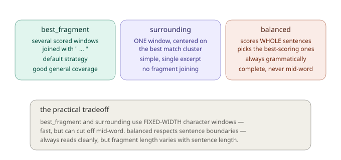
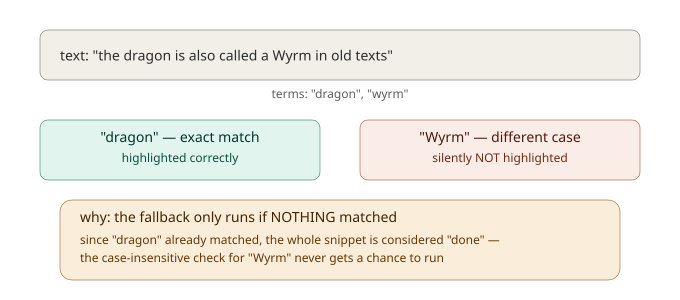
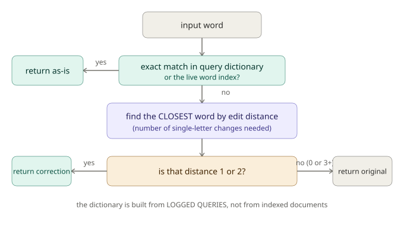

# Chapter 7: Making Results Readable, Snippets and Query Understanding

Here's a question worth sitting with for a moment: what actually makes a search result *useful* to a person looking at it? So far, we've spent six chapters getting GMLiteSearch to find the *right* documents, relevant matches, correctly filtered, correctly ranked. But finding the right document and presenting it usefully are two different problems. If a player searches "fire dragon" and your UI just shows them a 600-character wall of undifferentiated text for each result, they still have to do the work of scanning through it to figure out *why* it matched, and *whether* it's actually what they wanted.

This is the gap between "technically correct search results" and "search results that feel good to use," and it's exactly what this chapter addresses from two angles. First, **snippet generation**, extracting a short, relevant, highlighted excerpt from each result instead of dumping the whole document. Second, **query understanding**, extending the typo-tolerance ideas from Chapter 3 into a fuller picture: correcting entire queries, suggesting completions as someone types, and learning from what people have searched for before.

This is also a chapter where I want to be genuinely candid with you about something: while researching and verifying this material, I found two real, confirmed issues in how the framework's snippet highlighting currently behaves. I'll walk through them clearly when we get there, with concrete, reproducible examples, not to discourage you from using the feature (it's still genuinely useful, and the issues are narrow), but because understanding *exactly* what a tool does, including its rough edges, makes you a better user of it than pretending everything is flawless.

## A new dataset: an in-world lore compendium

For this chapter, we need documents with genuinely substantial text, snippet extraction only gets interesting when there's real material to extract *from*. So we're building a lore compendium: 45 encyclopedia-style entries covering creatures, locations, historical events, and artifacts from a fantasy world, each with multiple full sentences of description (unlike our shorter item and NPC descriptions in earlier chapters).

```gml
var lore_entries = chapter7_get_lore_entries();

gmls_init();

for (var i = 0; i < array_length(lore_entries); i++) {
    var entry = lore_entries[i];
    gmls_add_document_weighted(entry.id, entry.text, { title: entry.name, tags: [], timestamp: current_time });
}
```

A representative entry, `lore_001`, describing "The Ashen Wyrm":

> *"The Ashen Wyrm is an ancient dragon said to have slumbered beneath the Cinder Mountains for over a thousand years. Scholars believe it once ruled the volcanic peaks before the great eruption that buried its lair in ash. Local legends claim the wyrm's breath can turn stone to glass, and that its scales are harder than tempered steel. Several expeditions have attempted to locate its resting place, though none have returned with conclusive evidence. The most recent survey, conducted by the Cartographer's Guild, mapped extensive tunnel systems beneath the mountains but found no trace of the creature itself."*

We'll use this exact entry throughout the snippet section, so you can follow along with real, checkable output.

## Part 1: Snippet generation

### Configuring snippet behavior

Before generating any snippets, it's worth knowing the actual defaults, since they might not be what you'd guess:

```gml
{
    default_length: 200,
    highlight_start: "**",
    highlight_end: "**",
    strategy: "best_fragment",
    fragment_count: 2,
    fragment_separator: " ... ",
    boost_title: true,
    boost_exact_phrase: 1.5
}
```

Notice the default highlight markers are `"**"` (Markdown-style bold), not brackets or HTML tags, if you're rendering snippets in a UI that doesn't understand Markdown, you'll want to reconfigure this. You can change any of these settings:

```gml
gmls_configure_snippets({
    highlight_start: "<b>",
    highlight_end: "</b>",
    default_length: 150,
    fragment_count: 2
});
```

`gmls_configure_snippets` merges your changes into the existing config rather than replacing it wholesale, you only need to specify the fields you want to change.

### Generating a snippet

```gml
var snippet = gmls_generate_advanced_snippet(doc_id, query, options);
```

```gml
var snippet = gmls_generate_advanced_snippet("lore_001", "dragon Cinder Mountains", undefined);
show_debug_message(snippet);
```

Against our real `lore_001` entry, using the default `best_fragment` strategy, this produces something like:

```
The Ashen Wyrm is an ancient **dragon** said to have slumbered beneath the Cinder Mountai ... uild, mapped extensive tunnel systems beneath the **mountains** but found no trace of the creature itself.
```

Take a moment to actually look at this output, because there's a genuinely important, honest lesson hiding in it.

### An honest limitation: fixed-width windows can cut off mid-word

Notice the first fragment ends at **"Cinder Mountai"**, cut off mid-word, before "Mountains" finishes. This isn't a random glitch; it's a direct, predictable consequence of how the `best_fragment` and `surrounding` strategies work: they select a **fixed-width character window** around a match, not a word-boundary-aware or sentence-aware window. If a match happens to fall near the edge of that fixed width, the window can, and will, cut off partway through whatever word happens to be there.

This matters practically for two reasons. First, it's cosmetically a little rough, a snippet ending mid-word looks unfinished. Second, and more importantly for what you're about to read: **a word that got cut off mid-way through cannot be correctly highlighted**, since the highlighting pass can only match text that's actually present in the snippet. In our example, "mountains" as a complete word doesn't exist in that first truncated fragment at all, only "Mountai" does, so there was genuinely nothing for the highlighter to match against.

Compare this to the `balanced` strategy (which we'll cover shortly), which selects whole sentences instead of fixed character windows, guaranteeing grammatically complete, never-mid-word fragments, at the cost of less precise control over exact snippet length.



### A second, more subtle issue: mixed-case highlighting can silently skip terms

Here's the second thing worth knowing clearly, because it's genuinely non-obvious and I want to walk you through exactly how I confirmed it rather than just assert it.

GMLiteSearch's highlighting works in two passes. First, it tries a direct, case-sensitive text replacement for each search term. If that succeeds for *any* term in the snippet, the highlighter considers its job essentially done. Only if the case-sensitive pass matched **nothing at all** does it fall back to a second, case-insensitive pass, designed to catch situations where the document's actual capitalization differs from the (typically lowercased) search term.

The problem: that fallback check only asks "did *anything* change?", not "did *every* term get its chance?" Consider a simple, real example: searching for `"dragon wyrm"` against text that reads *"the dragon is also called a Wyrm in old texts."* The tokenized search terms are `["dragon", "wyrm"]` (lowercase, as GMLiteSearch's tokenizer produces). "dragon" appears lowercase in the text, so it matches immediately on the case-sensitive pass. But because *something* already matched, **the case-insensitive fallback never runs at all**, meaning "Wyrm" (capitalized in the text) never gets checked, and is silently left unhighlighted, even though it's a completely genuine match for the search term "wyrm."



I verified this directly, and it reproduces consistently: whenever at least one search term happens to match the document's exact capitalization, any *other* term that would have needed the case-insensitive fallback gets silently skipped, purely because of the order in which terms happen to be checked, nothing about the term itself. This is a real, narrow limitation worth knowing about if your content has inconsistent capitalization and you're relying on every matched term being visibly highlighted.

### A third honest note: `boost_title` currently has no effect

One more thing worth being upfront about. The snippet configuration includes a `boost_title` option, defaulting to `true`, which reads like it should mean "if the title matches, favor including it in the snippet." While tracing through the actual `best_fragment` strategy's logic carefully, I found that the code which scores a potential title-based fragment does run, but the fragment it builds is never actually added to the pool of candidates that get selected from. In its current form, **`boost_title` doesn't currently influence which fragments end up in your final snippet**, regardless of how strongly the title matches. If you're relying on this setting to surface title matches specifically, it's worth knowing it isn't currently doing that, worth flagging to your team or working around directly (for instance, by checking `results[i].document.metadata.title` yourself and prepending it to the snippet if it's a strong match) until this is addressed in the framework.

None of this is meant to steer you away from snippets, they're still a genuinely useful feature, and these are narrow edge cases (specific truncation timing, specific case-mismatch situations, one unused config option), not something that breaks typical usage. But knowing about them means you won't be confused or blindsided if you happen to run into one.

### The three strategies

Now that you understand the honest tradeoffs, let's look at what each strategy actually does, and when you'd reach for each one.

**`best_fragment`** (the default) selects several scored windows around matches and joins them with a separator, good general-purpose coverage when matches are scattered across a longer document.

```gml
gmls_configure_snippets({ strategy: "best_fragment", fragment_count: 2 });
```

**`surrounding`** finds the single best cluster of nearby matches and returns one window centered on it, simpler, a single readable excerpt rather than multiple joined fragments.

```gml
gmls_configure_snippets({ strategy: "surrounding" });
var snippet = gmls_generate_advanced_snippet("lore_001", "dragon Cinder Mountains", undefined);
```

Against our same `lore_001` entry and query, this produces:

```
The Ashen Wyrm is an ancient **dragon** said to have slumbered beneath the Cinder Mountains for over a thousand years. Scholars belie...
```

Notice this version correctly includes the complete phrase "Cinder Mountains", but "Cinder" and "Mountains" still aren't highlighted, for the same case-sensitivity reason discussed above (the term "cinder" needs the fallback, which "dragon" matching first prevents from running).

**`balanced`** scores whole sentences (splitting on `.`, `!`, `?`) and selects the best-scoring ones, always keeping fragments grammatically complete:

```gml
gmls_configure_snippets({ strategy: "balanced", fragment_count: 2 });
```

Since this strategy works at the sentence level rather than a fixed character window, it never produces a mid-word cutoff, a genuine advantage when snippet readability matters more than precise length control.

### Exact phrase matching

If your query includes a quoted phrase, GMLiteSearch treats it specially, searching for that exact sequence of words rather than the individual terms independently:

```gml
var snippet = gmls_generate_advanced_snippet("lore_001", "\"Cinder Mountains\"", undefined);
```

Exact phrase matches receive a scoring boost (`boost_exact_phrase`, defaulting to `1.5`) when a fragment window is being evaluated for selection, a fragment containing the complete quoted phrase is considered more relevant than one merely containing the individual words scattered separately.

### Combining snippets with search results directly

Rather than generating snippets one document at a time after the fact, you can get them automatically attached to search results:

```gml
var results = gmls_search_with_snippets(query, max_results, snippet_options);
```

```gml
var results = gmls_search_with_snippets("dragon mountains", 5);
for (var i = 0; i < array_length(results); i++) {
    show_debug_message(results[i].highlighted_title);
    show_debug_message(results[i].snippet);
}
```

Each result comes back with both a `snippet` field (the extracted, highlighted excerpt) and a `highlighted_title` field (the document's title, with matching terms highlighted the same way), everything you need to render a polished search result directly.

### Getting multiple snippet options

Sometimes you want to offer several candidate excerpts and let something else (your own logic, or even a UI where a designer picks) choose between them, rather than committing to a single strategy's output:

```gml
var candidates = gmls_get_snippet_candidates(doc_id, query, max_candidates);
```

```gml
var candidates = gmls_get_snippet_candidates("lore_001", "dragon", 3);
for (var i = 0; i < array_length(candidates); i++) {
    show_debug_message(candidates[i].text + " (matched: " + candidates[i].term + ", position: " + string(candidates[i].position) + ")");
}
```

This works differently from `gmls_generate_advanced_snippet`, instead of one carefully assembled excerpt, it returns several independent, un-highlighted, fixed-window candidates (raw excerpts around each match position, not passed through the highlighting pass at all), each tagged with which term it matched and where. It's a lower-level building block, useful when you want to build your own selection or highlighting logic on top of the raw candidates rather than relying on the higher-level strategies.

## Part 2: Query understanding

Now let's shift to a different, complementary problem: helping people formulate a *good query* in the first place, before or alongside the search itself.

### Logging queries: the foundation everything else builds on

Before query understanding features can do anything useful, GMLiteSearch needs data about what people have actually searched for. That's what `gmls_log_query` provides:

```gml
gmls_log_query(query, result_count, selected_index);
```

```gml
gmls_log_query("fantasy rpg", 3, 0);  // searched "fantasy rpg", got 3 results, player clicked result 0
gmls_log_query("dragon lore", 5, 2);
gmls_log_query("fantasy games", 8, -1);  // -1 means nothing was clicked
```

This is worth calling out clearly, because it explains behavior you might otherwise find confusing later: **the spelling dictionary that powers spell-checking and the suggestions that power autocomplete are built entirely from this logged query history**, not directly from your indexed document content. A freshly initialized index with lots of great content but zero logged queries will have empty, unhelpful spell-check and suggestion results, even though the documents themselves are perfectly searchable. You need real (or realistically simulated, during development) query traffic flowing through `gmls_log_query` before these features have anything meaningful to work with.

### Spell-checking with real edit distance

Back in Chapter 3, we learned that `gmls_fuzzy_search` uses bigram similarity, a technique that's genuinely good at some typo types (missing letters) and genuinely weak at others (transpositions). Query-level spell-checking uses a **different, more precise technique**: true **Levenshtein edit distance**, literally counting the minimum number of single-character insertions, deletions, or substitutions needed to turn one word into another.

```gml
var corrected = gmls_spell_check(word);
```

Here's the decision process in full:



Let's see this in action, using a simulated query history built around our marketplace-style vocabulary:

```gml
gmls_log_query("fantasy rpg", 10, 0);
gmls_log_query("strategy games", 8, 1);
gmls_log_query("puzzle games", 5, 0);
gmls_log_query("action adventure", 6, 2);

show_debug_message(gmls_spell_check("stratgy"));    // -> "strategy"
show_debug_message(gmls_spell_check("puzzel"));     // -> "puzzle"
show_debug_message(gmls_spell_check("adventur"));   // -> "adventure"
show_debug_message(gmls_spell_check("fantasyy"));   // -> "fantasy"
```

Notice this correctly handles a genuinely varied set of typo types, a missing letter ("adventur"), an extra letter ("fantasyy"), and a transposition-adjacent substitution ("stratgy"), precisely because true edit distance, unlike Chapter 3's bigram approach, doesn't have a structural blind spot for any particular kind of single-character change.

### Correcting an entire query

```gml
var result = gmls_correct_query(query);
```

```gml
var result = gmls_correct_query("stratgy games");
show_debug_message("Original: " + result.original);
show_debug_message("Corrected: " + result.corrected);
show_debug_message("Changed: " + string(result.changed));
```

This runs `gmls_spell_check` across every word in the query independently, then reassembles them, giving you a `changed` flag so you can decide whether to show a "did you mean...?" prompt only when something actually got corrected, rather than always displaying it.

### Auto-complete suggestions

```gml
var suggestions = gmls_get_suggestions(prefix, max);
```

```gml
var suggestions = gmls_get_suggestions("fan", 5);
for (var i = 0; i < array_length(suggestions); i++) {
    show_debug_message(suggestions[i]);
}
```

Suggestions are drawn from **two combined sources**: your logged popular queries (ranked by how often that exact query has been searched), and individual words from your live document index (ranked by how often they've appeared in logged queries, defaulting to a base frequency if never explicitly searched). Against a simulated query history where "fantasy rpg" (12 searches), "fantasy games" (8 searches), and "fantasy adventure" (4 searches) had all been logged, `gmls_get_suggestions("fan", 5)` correctly returns all three, ordered by their logged frequency, most-searched first.

There's a minimum prefix length (`min_prefix_length`, defaulting to 2), searching for a single character returns no suggestions at all, which is a sensible default given how unfocused a one-character prefix's results would otherwise be.

### Related queries

```gml
var related = gmls_get_related_queries(query, max);
```

This is the richest of the query-understanding functions, and it's worth knowing it draws from **several different signals simultaneously**, not just one:

- **Click co-occurrence**: if people who searched your query also frequently clicked on documents that other queries also led to, those other queries are considered related (built from `gmls_record_click_with_query` data).
- **Term overlap with popular queries**: other logged queries sharing words with your current query, weighted by how popular those other queries are.
- **Prefix completions**: the last word of your query gets treated as a prefix, and completions of it get proposed as related, longer queries.
- **Category signals**: if your query returns results with facet data (connecting back to Chapter 4), the categories of your top results get suggested as their own related queries (formatted as `"<category> games"`).

```gml
gmls_log_query("fantasy rpg", 10, 0);
gmls_log_query("fantasy adventure", 6, 0);
gmls_record_click_with_query("fantasy rpg", "gm_001");
gmls_record_click_with_query("dragon lore", "gm_001");

var related = gmls_get_related_queries("fantasy rpg", 5);
```

Because a genuinely useful demonstration of this function benefits from realistic click data accumulated over many queries, it's worth experimenting with directly against your own accumulating query log as your game's search usage grows, rather than expecting rich results from a handful of manually logged test queries.

### Popular queries and statistics

Two smaller, more straightforward functions round out this chapter:

```gml
var popular = gmls_get_popular_queries(limit);
```

Returns your most frequently logged queries, ranked by count, useful for a "trending searches" display.

```gml
var stats = gmls_get_query_stats();
```

Returns `total_queries` (total logged, capped internally at the most recent 1000), `unique_queries`, `dictionary_size` (how many unique words are in your spelling dictionary), and the current `suggestions_enabled`/`auto_correct_enabled` flags.

## What you've learned

- **Snippets turn a full document into a short, relevant, highlighted excerpt**, essential for making search results actually scannable rather than overwhelming.
- **The default highlight markers are `"**"` (Markdown-style)**, not brackets or HTML, reconfigure via `gmls_configure_snippets` if your UI needs something else.
- **`best_fragment` and `surrounding` use fixed-width character windows**, which can cut off mid-word, a genuine, verified limitation. **`balanced` avoids this** by working at the sentence level instead.
- **Two confirmed, narrow issues worth knowing about**: `boost_title` currently has no effect on fragment selection despite existing as a config option, and mixed-case documents can have some search terms silently left unhighlighted if an earlier term already matched case-sensitively in the same snippet.
- **`gmls_get_snippet_candidates`** offers raw, un-highlighted candidate excerpts as a lower-level building block, distinct from the higher-level strategy functions.
- **Query understanding depends entirely on logged query history** via `gmls_log_query`, spell-check and suggestions have nothing to work with until real (or simulated) query traffic has been logged.
- **`gmls_spell_check` uses true Levenshtein edit distance**, a more precise technique than Chapter 3's bigram-based fuzzy search, correcting words within an edit distance of 1 or 2.
- **`gmls_get_related_queries`** combines click co-occurrence, term overlap, prefix completion, and category signals into one ranked list, genuinely useful, but benefits from real accumulated usage data to shine.

## What's next

Everything through this chapter has been about finding, filtering, and presenting documents, genuinely comprehensive coverage of "traditional" search. But there's a fundamentally different idea we haven't touched yet: what if the *ranking itself* could be learned and improved over time, based on what people actually click on, rather than staying fixed to a single formula like BM25 forever?

**Chapter 8** begins a three-chapter arc into **Learning-to-Rank**, genuinely the most advanced material in this entire series. We'll start from first principles: what does it even mean for a machine to "learn" a ranking, using a plain-language analogy before any code, and then build your first trainable ranking model from the ground up.

See you there.
