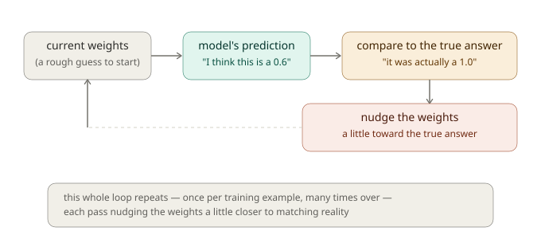
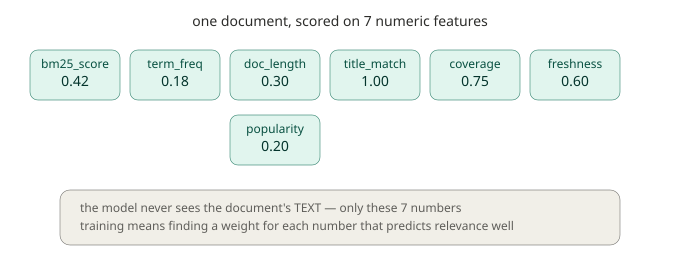
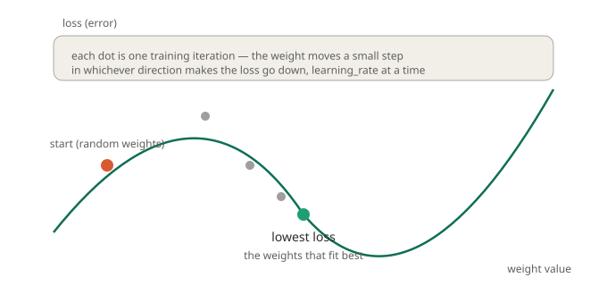
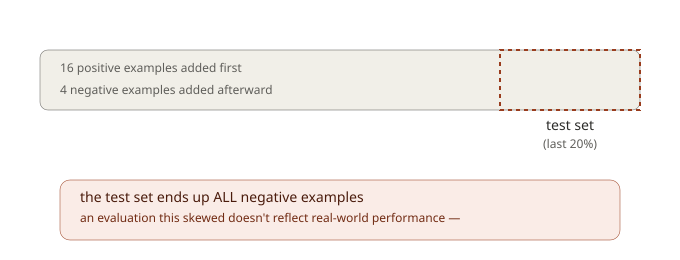

# Chapter 8: Teaching the Machine, Introduction to Learning-to-Rank

Take a moment to think back to Chapter 1, and the very first idea this whole series introduced: search results should be **ranked**, not just matched. We built that ranking using BM25, a fixed mathematical formula that scores documents based on word frequency, document length, and how rare a matched term is across your whole collection. BM25 is genuinely good at what it does, and everything through Chapter 7 has relied on it.

But here's a question worth sitting with: is BM25's specific formula always the *right* way to rank things for *your* game? What if, for your particular players, a document's title mattering enormously turns out to be far more predictive of what people actually click than BM25's default weighting suggests? What if freshness, how recently something was added, should matter a lot for one kind of search and barely at all for another? BM25 has no way to adapt to any of this. It's the same fixed formula, forever, regardless of what your actual players demonstrate they care about through their behavior.

This chapter begins a three-chapter arc into **Learning-to-Rank**, often abbreviated **LTR**, a fundamentally different approach where, instead of hand-picking a formula, you let the ranking itself be **learned** from data. This is also, honestly, the most conceptually demanding material in this entire series. So we're going to go slowly, and we're going to build up the ideas from first principles, with a genuine, plain-language explanation of what "training a model" even means before we write a single line of GML.

## What does it mean for a machine to "learn" something?

Let's start with an analogy that has nothing to do with computers at all.

Imagine you're trying to guess someone's age just by looking at a photo. You don't have an exact formula for this, nobody does, but you're not guessing randomly either. You're unconsciously weighing several visible clues: how much gray hair is visible, how many visible wrinkles, posture, clothing style, and so on. Some of these clues matter more than others, gray hair is probably a stronger signal than clothing style, since clothing style varies wildly across ages. Somewhere in your head, you've built up a rough, intuitive sense of **how much weight each clue deserves**, purely from years of seeing photos of people and later learning their actual ages.

That, in a genuine and non-hand-wavy sense, is exactly what "training a model" means. You have a set of **features**, measurable clues (gray hair amount, wrinkle count, whatever's observable), and you have a **target** you're trying to predict (the person's actual age). Training means adjusting how much **weight** you give each feature, based on many examples where you *do* know the right answer, so that your predictions get progressively closer to reality.

In our search context, the "photo" is a document, the "clues" are numeric features describing how well it matches a query, and the "actual age" is a relevance score you (or your players' behavior) have told the system is correct. Training means finding the right weight for each feature, how much should BM25 score matter, versus title match, versus freshness, so that predicted relevance lines up with actual relevance as closely as possible.



This loop, predict, compare to the truth, adjust slightly, repeat, is the entire conceptual core of everything in this chapter and the two that follow. Every algorithm we'll cover across this whole LTR arc, no matter how sophisticated it eventually gets, is fundamentally doing some version of this loop.

## From words to numbers: what a "feature" actually is here

Before a machine can learn anything, everything it learns from needs to be expressed as **numbers**, a computer can't directly reason about "this document's writing style feels authoritative." So the first real question in building any Learning-to-Rank system is: **what numeric measurements should describe a document, for a given query?**

GMLiteSearch comes with 7 built-in features, computed automatically for every document/query pair. It's worth knowing exactly what each one measures, since these are the raw material everything else in this chapter builds on:

| Feature | What it measures |
|---|---|
| `bm25_score` | The document's ordinary BM25 relevance score, everything from Chapters 1-3, folded in as just one signal among several |
| `term_frequency` | What fraction of the document's words are query terms |
| `doc_length_norm` | Document length, capped and normalized (longer documents up to 500 words score higher, then plateau) |
| `title_match` | What fraction of query terms appear in the document's title |
| `term_coverage` | What fraction of *distinct* query terms appear anywhere in the document |
| `freshness` | How recently the document was added, decaying over roughly a 30-day scale |
| `popularity` | How often the document has been clicked relative to how often it's been shown |

Here's the crucial conceptual point: **once these 7 numbers are computed, the model never looks at the document's actual text again.** It has no idea what the document says, only these numbers. This is worth internalizing clearly, because it explains both the power and the limits of this approach: the model can learn "documents with high title_match tend to be more relevant" without ever understanding *why* that's true, purely from statistical patterns across many examples.



## The linear model: the simplest possible starting point

With features established, we need a way to combine them into a single predicted relevance score. The simplest possible approach, and the one GMLiteSearch's `"linear"` model uses, is to multiply each feature by its own weight, and add everything up:

```
predicted_relevance = (weight_1 × feature_1) + (weight_2 × feature_2) + ... + (weight_7 × feature_7)
```

That's genuinely the whole model. No hidden complexity, no layers, no nonlinear transformations, just a weighted sum. "Linear" refers to exactly this: the prediction is a straight, linear combination of the inputs. It's the same kind of model behind the phrase "linear regression," if you've encountered that term before.

The entire learning problem, then, reduces to a single question: **what set of 7 weights makes this weighted sum predict relevance as accurately as possible, across all your training examples?**

## Building training data

Before training anything, you need examples, documents, queries, and a relevance judgment for each pairing. This is where a genuinely important lesson comes in, one that's easy to get wrong in a way that quietly ruins your results without any error message telling you so.

### The lesson: training data needs real variation to be learnable

Consider a naive approach: for a query like "fantasy rpg," you might be tempted to grab a handful of games that are *obviously* great matches and mark them all as maximally relevant. The problem: if every single training example for a query has the *same* relevance score, there's genuinely nothing for the model to learn from that query, there's no "better" or "worse" to distinguish, no gradient pointing anywhere useful.

Real, learnable training data needs **competing documents with genuinely different relevance levels** for the same query, some strong matches, some partial matches, and ideally some clear non-matches. Let's build exactly that, using games from our Chapter 4/5 marketplace:

```gml
gmls_enable_ltr(true);

// Query: "fantasy rpg" - a genuine spread of relevance
gmls_add_training_example("fantasy rpg", "gm_001", 1.0);  // rpg category + fantasy tag: strong match
gmls_add_training_example("fantasy rpg", "gm_002", 1.0);  // rpg category + fantasy tag: strong match
gmls_add_training_example("fantasy rpg", "gm_050", 1.0);  // rpg category + fantasy tag: strong match
gmls_add_training_example("fantasy rpg", "gm_073", 1.0);  // rpg category + fantasy tag: strong match
gmls_add_training_example("fantasy rpg", "gm_005", 0.67); // rpg category, but sci-fi not fantasy: partial match
gmls_add_training_example("fantasy rpg", "gm_006", 0.67); // rpg category, but post-apocalyptic: partial match
gmls_add_training_example("fantasy rpg", "gm_064", 0.67); // fantasy tag, but strategy not rpg: partial match
gmls_add_training_example("fantasy rpg", "gm_039", 0.0);  // racing game: no match at all

// Query: "cozy relaxing" - another genuine spread
gmls_add_training_example("cozy relaxing", "gm_037", 1.0);
gmls_add_training_example("cozy relaxing", "gm_057", 1.0);
gmls_add_training_example("cozy relaxing", "gm_063", 0.67);
gmls_add_training_example("cozy relaxing", "gm_034", 0.67);
gmls_add_training_example("cozy relaxing", "gm_012", 0.0);

// Query: "strategy diplomacy"
gmls_add_training_example("strategy diplomacy", "gm_016", 1.0);
gmls_add_training_example("strategy diplomacy", "gm_064", 0.67);
gmls_add_training_example("strategy diplomacy", "gm_039", 0.0);
```

`gmls_add_training_example(query, doc_id, relevance_score)` doesn't just log the query and score, it immediately computes and stores the full 7-feature vector for that document/query pair, using `_gmls_extract_features` internally (the same feature computation we discussed above). This is worth knowing: the moment you call this function, the actual searchable document must already exist in your index, since the features are computed from real, current document data at that moment, not recomputed later at training time.

## Training the model

With genuinely varied training data in place, let's actually train:

```gml
var log = gmls_train_linear_model(iterations, learning_rate);
for (var i = 0; i < array_length(log); i++) {
    show_debug_message(log[i]);
}
```

```gml
var log = gmls_train_linear_model(200, 0.05);
```

Running this against our 16 real training examples produces something like:

```
Training linear model on 16 examples
Iteration 0 - Loss: 0.0265
Iteration 20 - Loss: 0.0168
Iteration 40 - Loss: 0.0168
Converged at iteration 51
Training complete
```

Notice the **loss** decreasing across iterations, then flattening out, this is the model's error shrinking as training proceeds, exactly the "predict, compare, adjust" loop from our age-guessing analogy, run many times over. Let's actually understand what's happening mathematically now, since you're ready for it.

### Understanding gradient descent, precisely

The specific algorithm GMLiteSearch uses to adjust weights is called **gradient descent**, and here's the genuine mathematical intuition behind the name, not just an analogy.

Imagine plotting "loss" (how wrong the model currently is) on one axis, against a particular weight's value on another. This produces a curve, often shaped roughly like a valley, high on both ends, with a low point somewhere in the middle representing the best possible weight value. Training starts at some (probably bad) point on this curve, and the question at every step is: **which direction should this weight move to make loss go down?**



The "gradient" is literally the slope of this curve at your current position, calculus tells you the exact direction of steepest increase, so moving in the *opposite* direction is guaranteed to decrease loss, at least for a small enough step. That's genuinely the whole idea: **calculate the slope, take a small step downhill, repeat.**

Concretely, for our linear model with squared-error loss, the math works out to a specific formula:

```
gradient = -2 × error × feature_value
new_weight = current_weight - (learning_rate × gradient)
```

Where `error` is `(actual_relevance - predicted_relevance)`. Notice what this formula is actually saying, in plain terms: if a feature's value was high for a document, and the model badly underpredicted that document's relevance, the gradient pushes hard to *increase* that feature's weight (since apparently it should have counted for more). If the model already had it about right, `error` is small, and the weight barely moves at all. **The size of the correction is proportional to how wrong the prediction was, and how much that particular feature was "responsible" for the prediction.**

### The learning rate: how big a step to take

You'll notice `gmls_train_linear_model` takes a `learning_rate` parameter (we used `0.05` above; the function's own default is `0.001`). This controls exactly how big each downhill step is.

Think about walking down an actual hillside toward a valley floor. Take steps that are too small, and you'll get there eventually, but it might take an exhausting number of steps, in training terms, this means needing far more iterations to converge, or worse, running out of iterations before ever really getting close. Take steps that are too large, and you risk overshooting the valley floor entirely, bouncing back and forth across it without ever settling, in training terms, loss can actually get *worse* between iterations, or oscillate instead of smoothly decreasing.

There's no universally correct learning rate, it depends on your specific features' scale and your data. If you see loss failing to decrease, or behaving erratically, try a smaller learning rate. If training seems to need an enormous number of iterations to converge at all, a larger learning rate may help it move more efficiently.

## Using the trained model

Once trained, the model's weights live in the same place we've been managing since Chapter 2, you can inspect them directly:

```gml
var stats = gmls_get_ltr_stats();
var weights = stats.feature_weights;
var weight_names = variable_struct_get_names(weights);
for (var i = 0; i < array_length(weight_names); i++) {
    show_debug_message(weight_names[i] + ": " + string(weights[$ weight_names[i]]));
}
```

Against our real training run, this produces something like:

```
bm25_score: 0.5813
title_match: 0.5000
term_coverage: 0.6355
```

Worth pausing on `title_match` staying at exactly its starting value of `0.5000`, completely unchanged by training. This isn't a bug, it's the gradient formula working exactly as designed, revealing something genuinely true about our training data: **none of our example documents happened to have query words appearing in their titles**, so `title_match` was `0` for every single example. Look back at the gradient formula: `gradient = -2 × error × feature_value`. When `feature_value` is always `0`, the gradient is always `0` too, there's nothing to learn, because the feature never varied and never contributed to any prediction. This is a genuinely useful diagnostic signal in practice: **a weight that never moves during training is telling you that feature had no signal in your training data**, not necessarily that the feature is unimportant in general.

Now let's actually search with the trained model:

```gml
var results = gmls_search_ltr("fantasy rpg", 5);
for (var i = 0; i < array_length(results); i++) {
    show_debug_message(results[i].document.metadata.title + " (ltr_score: " + string(results[i].ltr_score) + ", bm25: " + string(results[i].original_score) + ")");
}
```

Each result now carries both `ltr_score` (the trained model's prediction) and `original_score` (plain BM25, for comparison), letting you directly see how the learned ranking differs from the fixed formula you'd get without any training at all.

## Evaluating the model, and an honest limitation worth knowing

It's not enough to just trust that training "worked", you want some measure of how accurate the trained model actually is. `gmls_evaluate_model` provides exactly this:

```gml
var eval = gmls_evaluate_model(test_ratio);
show_debug_message("MSE: " + string(eval.mse));
show_debug_message("MAE: " + string(eval.mae));
show_debug_message("RMSE: " + string(eval.rmse));
```

This works by holding back a portion of your training examples (controlled by `test_ratio`, defaulting to `0.2`, meaning 20%) as a **test set**, data the evaluation checks predictions against, conceptually separate from what was used to fit the weights. It reports three related measures of error: **MSE** (mean squared error, the same quantity the training loss itself tracks), **MAE** (mean absolute error, often more intuitive, since it's in the same units as your relevance scores directly, without the squaring), and **RMSE** (root mean squared error, MSE's square root, which brings it back to relevance-score-like units too, while still penalizing large errors more than MAE does).

Here's something worth knowing clearly before you rely on this function, because I traced through exactly how the test set gets selected, and it's not what you might assume: **the test set is simply the *last* N% of your training examples, in the order you added them, not a random sample.** This matters in a very concrete, practical way. Imagine you logged all your strongly-positive training examples first, then went back later and added a batch of negative (irrelevant) examples afterward, a genuinely plausible, ordinary workflow. Since the test set is just "whatever was added last," you could end up with a test set that's *entirely* negative examples, giving you an evaluation that says nothing meaningful about how well your model handles the full range of relevance it was actually trained on.



The practical fix: if you're relying on `gmls_evaluate_model` for a genuinely meaningful accuracy check, make sure your training examples are added in a roughly randomized or well-mixed order with respect to relevance level, not systematically clustered by score, so that "the last 20%" ends up being a reasonably representative slice rather than an accidentally skewed one.

## Persisting a trained model

Training takes real computation, and you generally don't want to retrain from scratch every time your game starts. GMLiteSearch lets you save and reload trained weights:

```gml
var model_json = gmls_save_ltr_model();
// store model_json somewhere persistent - a file, a save slot, etc.

// later, in a fresh session:
gmls_load_ltr_model(model_json);
```

This saves (and restores) the feature weights and which model type is active, letting you train once, perhaps during development or as an offline process, and ship the resulting weights with your game rather than requiring every player's session to train its own model from scratch.

## What you've learned

- **Training a model** means adjusting weights so predictions get closer to known-correct answers, through repeated predict-compare-adjust cycles, the same idea whether you're guessing ages from photos or ranking search results.
- **Features are numeric measurements** describing a document/query pair, the model never sees raw text, only these numbers, which explains both its power (statistical pattern-finding) and its limits (no real "understanding").
- **The linear model** predicts relevance as a weighted sum of features, the simplest possible combination, and the foundation the next two chapters will build genuinely more sophisticated alternatives on top of.
- **Training data needs real relevance variation** to be learnable, a lesson worth taking seriously, since data with no variation silently produces a model that learns nothing useful, without any error telling you so.
- **Gradient descent** adjusts weights by calculating which direction reduces error fastest, and taking a small step that way, repeated many times, this is genuinely "walking downhill" toward the best-fitting weights.
- **The learning rate controls step size**, too small wastes iterations, too large risks overshooting or oscillating.
- **A weight that doesn't move during training** is a genuine diagnostic signal: that feature had no variation in your training data, not necessarily that it's unimportant.
- **`gmls_evaluate_model`'s test split is order-dependent, not random**, a real limitation worth accounting for by mixing relevance levels throughout your training data's insertion order.
- **`gmls_save_ltr_model` / `gmls_load_ltr_model`** let you persist trained weights, avoiding the need to retrain from scratch every session.

## What's next

The linear model has a real, honest limitation worth naming clearly: it's trained to predict an *absolute* relevance number as accurately as possible, but what search actually needs is a good *order*. These aren't quite the same goal. A model could be somewhat inaccurate on every individual prediction, yet still get every pairwise ordering exactly right, or vice versa.

In **Chapter 9**, we'll explore **RankNet**, a genuinely different approach that learns directly from *comparisons* ("this document should outrank that one") rather than absolute numbers, and we'll build **custom feature extractors**, letting you teach the model about signals specific to your own game that the 7 built-in features can't capture.

See you there.
