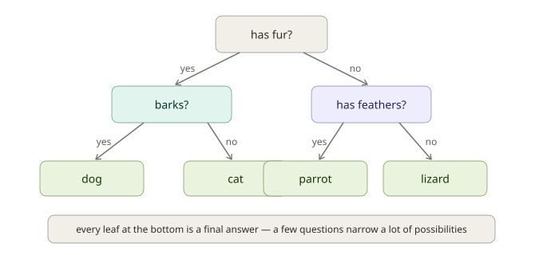
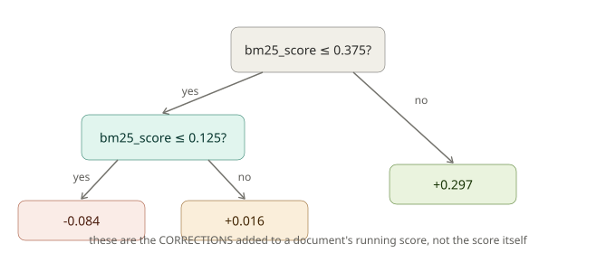
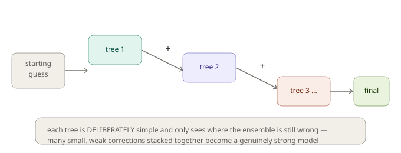
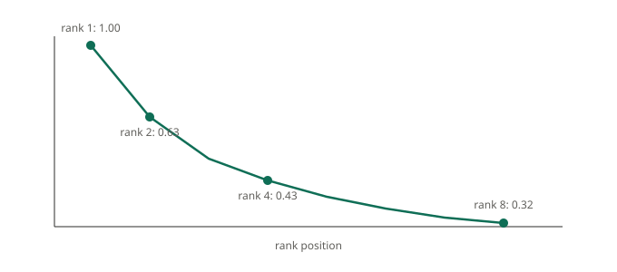
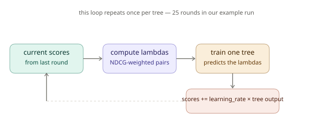

# Chapter 10: Decision Trees, Boosting, and LambdaMART

We've arrived at the final chapter, and it's genuinely the most demanding one in this entire series, both mathematically and in terms of how many ideas need to click together before it all makes sense. Take your time with this one. We're going to build up every concept from scratch, the same patient way we've approached everything else in this tutorial, starting with an idea that has nothing to do with search or machine learning at all.

By the end, you'll understand **LambdaMART**, the algorithm behind many real, production search and recommendation systems, and genuinely the most sophisticated thing GMLiteSearch offers. We'll close the whole series with a tour of the framework's developer tools, so you're equipped to debug and validate a real search deployment, not just build one.

## Part 1: What is a decision tree?

Forget search entirely for a moment. Imagine you're trying to guess what animal someone is thinking of, and you're only allowed to ask yes-or-no questions. A reasonable strategy: ask "does it have fur?" first, since that single question eliminates a huge swath of possibilities at once. If yes, maybe ask "does it bark?" next, narrowing further. If no, maybe ask "does it have feathers?" instead.



This is genuinely, precisely what a **decision tree** is: a structure that asks a sequence of simple yes-or-no questions, where each answer leads you down a different branch, until you reach a final answer at the bottom (called a **leaf**). Nothing more mysterious than that. The "learning" part comes from a genuinely interesting question: **given a bunch of examples with known correct answers, how do you figure out which questions to ask, and in what order, so that you reach correct answers as reliably as possible?**

### From animals to numbers: regression trees

The tree above answers a *categorical* question (which animal?). GMLiteSearch's trees answer a *numeric* question instead, given a document's features, predict a single number. This variant is called a **regression tree**, and the underlying idea is identical: ask a sequence of yes-or-no questions about the feature values (`is bm25_score ≤ 0.375?`), and end up at a leaf holding a predicted number rather than a category label.

### How does the tree decide which question to ask?

This is the genuinely clever part, and it's worth understanding precisely rather than taking on faith. At each point while building the tree, the algorithm considers every feature, and every possible threshold for that feature, and asks: **"if I split my current examples into two groups based on this exact question, how much does that reduce the *variance*, the spread, of target values within each group?"**

Concretely: before splitting, you have one group of examples with some scattered mix of target values. After a good split, you'd ideally have two groups, each one much more internally consistent than the original mixed group was, one group mostly high values, one group mostly low values. The specific split that achieves the *biggest* reduction in that internal scatter, across every feature and every threshold considered, is the one the tree actually picks.

### A real, verified tree from our own training data

Let's ground this in something concrete rather than staying purely abstract. Here's an actual tree, trained on real feature data from a batch of games competing for various search queries in our marketplace:



This tree asks exactly two questions: first, "is `bm25_score` at or below 0.375?" If yes, it asks a second, more refined question: "is it at or below 0.125?" Depending on the answers, it lands on one of three different predicted correction values. Notice something important about what these numbers actually represent: they're not final relevance scores, they're **corrections**, meant to be added on top of a running prediction. We'll see exactly why in a moment, once boosting enters the picture.

## Part 2: Gradient boosting, many weak trees, one strong model

A single small tree, like the one above, is genuinely limited, with only two or three simple questions, it can only carve the world into a handful of coarse groups. That's not nearly expressive enough to capture the real, nuanced relationships in most data on its own.

**Gradient boosting** solves this with a surprisingly elegant trick: instead of trying to build one large, complicated tree that gets everything right, build **many small, simple trees, one after another, where each new tree's entire job is to correct whatever mistakes the trees built so far are still making.**



Here's the loop, precisely:

1. Start with a simple initial prediction (often just the average of all target values, a reasonable, if generic, starting guess).
2. Look at the **residual**, how far off the current prediction is from the true target, for every example.
3. Train a new, small tree specifically to predict *those residuals*, not the original targets, but the errors the current ensemble is still making.
4. Add this new tree's predictions on top of the running total, scaled down by a small **learning rate** (the same concept from Chapter 8, a smaller learning rate means gentler, more cautious corrections, requiring more rounds but reducing the risk of overcorrecting).
5. Repeat, using the *updated* running predictions to compute fresh residuals for the next tree.

This is genuinely why the tree we looked at above produces small correction values (`-0.084`, `+0.016`, `+0.297`) rather than large, final-looking numbers, it's not trying to be the whole answer by itself. It's one small, deliberately modest nudge in an ensemble of many such nudges, each one chipping away at whatever error remains after all the trees before it.

## Part 3: NDCG, a metric built specifically for ranking

Before we can combine trees and boosting into something specifically good at *ranking* (rather than just numeric prediction in general), we need one more building block: a way to precisely measure "how good is this ranking," that genuinely reflects what makes a ranking good for a real person using it.

### Why a plain accuracy count isn't quite right

Imagine two rankings of 4 documents, both getting exactly 2 out of 4 positions "correct" in some sense. Are they equally good? Not necessarily, if one ranking has its correct items in positions 1 and 2 (top of the list, where a user actually looks), and the other has its correct items in positions 3 and 4 (buried at the bottom), the first ranking is clearly, meaningfully better for an actual person scanning results top to bottom. A metric that just counts "how many are right" completely misses this.

### The discount: making top positions count for more

**NDCG** (Normalized Discounted Cumulative Gain) solves this with a **rank discount**, a mathematical weighting where being right at rank 1 counts for meaningfully more than being right at rank 8. The specific formula uses a logarithm:

```
discount at rank N = log2(N + 1)
```

Let's look at exactly how steeply this drops off, since the shape of this curve is the entire reason NDCG behaves the way it does:



Position 1 gets full weight (1.00). Position 2 already drops to 0.63, a meaningful decrease. By position 8, the weight has flattened out to 0.32, and further positions barely change at all. This is a genuinely deliberate, important shape: **the curve is steep at the top and flat at the bottom**, meaning fixing a mistake near the top of a ranking matters far more, mathematically, than fixing an equivalent mistake buried near the bottom. This precisely mirrors real user behavior, people overwhelmingly look at the first few results and rarely scroll deep.

### The full formula

Putting the discount together with actual relevance values:

```
DCG = Σ (2^relevance - 1) / log2(rank + 1)
```

The `2^relevance - 1` part (called the **gain**) means higher relevance scores contribute exponentially more, not just linearly, a relevance-3 document contributes far more gain than a relevance-1 document, not merely three times as much.

**NDCG** simply normalizes this DCG by dividing by the best-possible DCG (the same documents, in their ideal order), giving you a score always between 0 (worst) and 1 (perfect), regardless of how many documents or how spread out the relevance values happen to be:

```
NDCG = DCG / Ideal_DCG
```

You can compute this directly:

```gml
var score = gmls_ndcg(relevances);
```

```gml
var perfect_order = [3, 2, 1, 0];
show_debug_message(string(gmls_ndcg(perfect_order)));  // 1.0 - already ideal

var scrambled_order = [1, 3, 0, 2];
show_debug_message(string(gmls_ndcg(scrambled_order)));  // notably less than 1.0
```

## Part 4: LambdaMART, combining everything

We now have every piece we need: regression trees, boosting, and NDCG. LambdaMART combines all three into a single, genuinely powerful algorithm, with one more clever idea layered on top: instead of training trees on plain numeric residuals (like ordinary gradient boosting), LambdaMART trains trees on **"lambda" gradients**, corrections specifically weighted by how much fixing each particular pairwise mistake would improve NDCG.

### Lambda gradients: RankNet's pairwise idea, weighted by NDCG

Recall RankNet from Chapter 9: for every pair of documents under the same query with different relevance, compute a sigmoid-based signal pushing the higher-relevance document's score above the lower one's. LambdaMART's lambda gradients use this exact same pairwise mechanism, with one crucial addition: **each pair's correction gets scaled by how much swapping that specific pair would actually change NDCG.**

This means: a mis-ranked pair near the *top* of a result list (where the NDCG discount curve is steep) gets a much stronger correction than an equally mis-ranked pair near the *bottom* (where the curve has flattened out). The model is explicitly, mathematically told: "getting the top of the list right matters more, focus your corrections there."



Every training round follows this exact loop: compute lambda gradients from the current scores, train one small tree specifically to predict those lambdas, then add that tree's (learning-rate-scaled) output back into the running scores, becoming the "current scores" that next round's lambda computation will use.

### Training a LambdaMART model

```gml
var result = gmls_train_lambdamart_model(samples, feature_names, n_trees, learning_rate, max_depth, min_samples_leaf);
```

`samples` here needs a specific shape: an array of structs with `features`, `target` (the relevance score), `query`, and `doc_id`, genuinely the same underlying information as `gmls_add_training_example`, just packaged for direct use with this lower-level training function (`gmls_train_lambdamart_model` operates on a samples array you construct yourself, giving you more direct control than the linear/RankNet training functions which read from the shared `ltr_training_data` list automatically).

```gml
var samples = [
    { features: { bm25_score: 0.8, title_match: 1.0 }, target: 3, query: "fantasy rpg", doc_id: "gm_001" },
    { features: { bm25_score: 0.3, title_match: 0.0 }, target: 1, query: "fantasy rpg", doc_id: "gm_005" },
    // ... many more, across many queries
];

var result = gmls_train_lambdamart_model(samples, ["bm25_score", "title_match", "term_coverage"], 25, 0.15, 3, 2);
for (var i = 0; i < array_length(result.log); i++) {
    show_debug_message(result.log[i]);
}

gmls_set_ltr_ensemble(result.ensemble);
gmls_set_ltr_model("lambdamart");
```

Running this against a realistic training set, 20 different query sessions, each with 4 competing games, ranked by genuine popularity-based relevance tiers, produces something like:

```
LambdaMART: 25 trees, lr=0.15, initial_value=1.50
  Initial avg NDCG: 0.7952
  Round 0 - Avg NDCG: 0.8602
  Round 5 - Avg NDCG: 0.8602
  Round 10 - Avg NDCG: 0.8602
  Round 15 - Avg NDCG: 0.8602
  Round 20 - Avg NDCG: 0.8602
  Round 24 - Avg NDCG: 0.8602
LambdaMART training complete: 25 trees built
```

### An honest limitation, verified precisely

Even the *honest* number above, 0.86 after training, up from 0.80, deserves a closer look rather than automatic satisfaction. Checking every individual query group's NDCG (not just the overall average) shows every single one still imperfect to some degree. This isn't a training failure, it's the direct, expected consequence of what we just learned about NDCG's discount curve. With only 4 competing documents per query, and NDCG weighting bottom-of-list errors so lightly, there's genuinely little mathematical pressure to perfect the last position or two, the gradient for correcting a rank-3-vs-rank-4 swap is real but small, exactly as the discount curve predicted. This matches, precisely, a pattern we've now seen twice in this series: **LambdaMART reliably nails the top of a ranking, and is honestly, structurally less aggressive about polishing the bottom**, a property of the algorithm, not a defect in any particular implementation.

### Scoring and persisting a trained ensemble

```gml
var score = gmls_ensemble_predict(ensemble, features);
```

```gml
var prediction = gmls_ensemble_predict(result.ensemble, { bm25_score: 0.8, title_match: 1.0, term_coverage: 0.9 });
```

And, exactly like the linear and RankNet models, you can persist a trained LambdaMART ensemble:

```gml
var model_json = gmls_save_lambdamart_model();
// later, in a fresh session:
gmls_load_lambdamart_model(model_json);
```

### Comparing all three models

Since all three LTR models, linear, RankNet, LambdaMART, plug into the same `gmls_search_ltr` interface, you can genuinely compare them head to head on identical data:

```gml
var models = ["linear", "ranknet", "lambdamart"];
for (var m = 0; m < array_length(models); m++) {
    gmls_set_ltr_model(models[m]);
    var results = gmls_search_ltr("fantasy rpg", 5);
    show_debug_message("Model: " + models[m]);
    for (var i = 0; i < array_length(results); i++) {
        show_debug_message("  " + results[i].document.metadata.title + " (score: " + string(results[i].ltr_score) + ")");
    }
}
```

Broadly: **linear** is the fastest to train and easiest to reason about, but limited to expressing relationships as a simple weighted sum. **RankNet** genuinely optimizes for ranking order rather than absolute prediction accuracy, while keeping the same simple linear scoring underneath. **LambdaMART** is the most powerful and most expensive, capable of learning real feature *interactions* that a weighted sum fundamentally cannot express (since a tree can ask "is bm25_score high AND is title_match also high?", a genuinely different kind of question than any linear combination can represent), at the cost of more computation and more training data needed to use that extra power well.

## Part 5: Developer tools, debugging and validating a real deployment

We've spent ten chapters building increasingly sophisticated search capabilities. Let's close by covering the tools GMLiteSearch provides specifically for understanding and debugging what your search system is actually doing, essential once you're relying on any of this in a real, shipped game.

### Understanding why a document scored the way it did

```gml
var explanation = gmls_explain_score(query, doc_id, verbose);
```

```gml
var explanation = gmls_explain_score("fantasy rpg", "gm_001", true);
```

This walks through, term by term, exactly how a document's BM25 score was assembled, which query terms matched, how often, and what each one's individual contribution was. This is invaluable when a ranking looks wrong and you need to understand *why*, rather than guessing.

### Measuring search performance

```gml
var profile = gmls_profile_search(query, iterations);
```

```gml
var profile = gmls_profile_search("fantasy rpg", 20);
show_debug_message("Average: " + string(profile.average_ms) + "ms");
```

Runs the same search repeatedly and reports timing statistics, useful for catching performance regressions as your index grows, or for deciding whether a given search mode (recall Chapter 3's fuzzy/prefix searches, which scan the whole vocabulary rather than using the fast inverted-index lookup) is fast enough for your use case at your actual data scale.

### Inspecting your index's health

```gml
var inspection = gmls_inspect_index(options);
```

```gml
var inspection = gmls_inspect_index({ show_top_terms: 10, show_sample_docs: 3 });
```

Gives you a health-check style overview, top terms by frequency, sample documents, and overall statistics, genuinely useful during development to sanity-check that your indexing pipeline is actually producing what you expect, before you're several chapters deep into building features on top of a subtly broken index.

### Benchmarking

```gml
var benchmark = gmls_benchmark(iterations);
```

Runs a suite of representative queries and reports aggregate performance, a broader check than `gmls_profile_search`'s single-query focus, useful for an overall sense of your search system's readiness before shipping.

### Analyzing exactly how a query gets processed

```gml
var analysis = gmls_analyze_query(query);
```

```gml
var analysis = gmls_analyze_query("The quick brown Fox");
show_debug_message("Terms: " + string(analysis.terms));
show_debug_message("Stop words removed: " + string(analysis.stop_words_removed));
```

Shows you exactly what your query looks like after tokenization and stop-word removal, genuinely useful for understanding surprising search results, since (as we learned all the way back in Chapter 1) what gets searched isn't always identical to what you typed.

### Automated sanity-check assertions

```gml
var test = gmls_assert_search(query, expected_min_results, test_name);
```

```gml
var test = gmls_assert_search("fantasy", 2, "Fantasy search sanity check");
```

A lightweight testing utility, assert that a query returns at least a certain number of results, with a named label. Genuinely useful for building a small regression-test suite that catches indexing or configuration mistakes automatically, rather than relying purely on manual spot-checks as your search system evolves.

## What you've learned, and what this whole series covered

- **Decision trees** ask a sequence of yes-or-no questions, choosing each split to maximize the reduction in scatter among target values, the same underlying idea whether guessing animals or predicting search relevance.
- **Gradient boosting** builds many small, weak trees in sequence, where each new tree's job is specifically to correct the current ensemble's remaining errors, many modest corrections stacked together become a genuinely strong model.
- **NDCG** measures ranking quality with a logarithmic rank discount, making errors near the top of a list matter far more than equivalent errors near the bottom, a deliberate, mathematically precise reflection of real user behavior.
- **LambdaMART** combines trees, boosting, and NDCG by training each tree on lambda gradients, pairwise corrections explicitly weighted by how much fixing them would improve NDCG.
- **LambdaMART's bottom-of-ranking weakness is a real, structural, mathematically-grounded property** of NDCG's discount curve, not a defect, consistent with the same NDCG behavior verified earlier in this chapter.
- **`gmls_explain_score`, `gmls_profile_search`, `gmls_inspect_index`, `gmls_benchmark`, `gmls_analyze_query`, and `gmls_assert_search`** round out the framework with genuine debugging and validation tools for a real, shipped deployment.

And more broadly, across this entire ten-chapter series: you started with the basic idea of an inverted index, and built all the way up through weighted documents, typo-tolerant search, faceted filtering, date-aware queries, real-world and game-world geospatial search, readable snippets, forgiving query understanding, and finally three genuinely different machine-learning approaches to ranking, linear regression, pairwise RankNet, and tree-boosted LambdaMART. That's a comprehensive, production-grade search toolkit, and you now understand not just *how* to call each function, but *why* each one works the way it does.

Thank you for working through this whole series. Go build something good with it.
