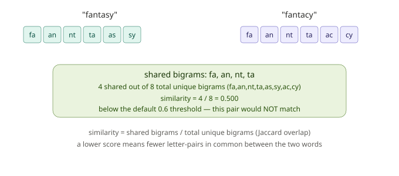
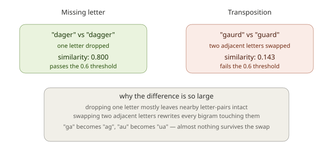
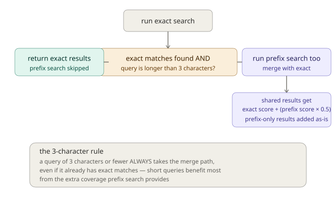
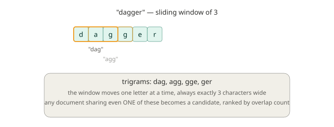

# Chapter 3: Typos, Prefixes, and Making Search Forgiving

Every search we've run so far has demanded precision. Type "guard" exactly, and you'll find it. Type "gaurd", a genuinely common, easy-to-make typo, and `gmls_search` will find nothing at all, because as far as the inverted index is concerned, "gaurd" simply isn't a word that appears anywhere in your data.

Real players don't type with textbook precision. They fat-finger keys, transpose letters, forget how many s's are in "resistance," and start typing a word without finishing it because they're hoping your search box will finish the thought for them. A search system that shatters on the first typo isn't just annoying, it actively undermines the reason search exists in the first place, which is to help people find things *despite* not knowing the exact words to ask for.

This chapter is about making GMLiteSearch forgiving. We'll cover four different search modes, fuzzy search, prefix search, hybrid search, and n-gram search, and, more importantly, we'll dig into *exactly* how each one works well enough that you understand their real strengths and real limitations, rather than treating them as a black box that "handles typos" in some vague, unspecified way. As you'll see, the honest picture is more interesting than that, and knowing the honest picture will make you much better at choosing the right tool for a given situation.

## A new dataset: the general store

For this chapter, we're stepping into a general store with a genuinely broad inventory, 70 items across blacksmith goods, apothecary supplies, enchanted trinkets, general trade goods, food and provisions, and travel tools. A representative slice:

```gml
var shop_items = [
    { id: "shp_002", name: "Tempered Steel Dagger", desc: "A precisely balanced dagger, tempered for extra durability in combat." },
    { id: "shp_011", name: "Resistance Tonic", desc: "A bitter tonic granting temporary resistance to poison and disease." },
    { id: "shp_012", name: "Apothecary's Mortar and Pestle", desc: "A stone mortar and pestle used for grinding herbs and minerals." },
    { id: "shp_035", name: "Waterproof Traveling Boots", desc: "Boots treated to resist water, ideal for long journeys through rain." },
    { id: "shp_062", name: "Fishing Rod and Tackle", desc: "A complete fishing setup including rod, line, and assorted lures." },
    { id: "shp_064", name: "Sturdy Walking Stick", desc: "A reinforced walking stick, useful for rough terrain or as a light weapon." },
    { id: "shp_067", name: "Portable Grindstone", desc: "A small grindstone for sharpening blades while away from a proper forge." },
    // ...63 more items across the full inventory
];

gmls_init();
for (var i = 0; i < array_length(shop_items); i++) {
    var item = shop_items[i];
    gmls_add_document_weighted(item.id, item.desc, { title: item.name, tags: [], timestamp: current_time });
}
```

We're using `gmls_add_document_weighted` from Chapter 2 here, since it's simply the better default, no reason to abandon what we already learned works well.

## What "fuzzy" actually means

Let's start with the function whose name most directly promises to solve our typo problem: `gmls_fuzzy_search`. Before looking at the code, it's worth understanding the general idea behind fuzzy text matching, because "fuzzy" gets used loosely in casual conversation to mean "smart" or "forgiving" without much precision about *how*.

There are several genuinely different techniques that all get called "fuzzy matching" in different systems: some measure the minimum number of single-character edits needed to turn one word into another (this is called **edit distance**, or Levenshtein distance, and it's what a lot of spell-checkers use). Others measure how much of the *shape* of two words overlaps, without caring about edit operations at all.

GMLiteSearch uses the second approach, specifically a technique based on **bigrams**. A bigram is simply a two-character chunk of a word, taken by sliding a two-letter window across it one letter at a time. "Cat" breaks into the bigrams "ca" and "at." "Fantasy" breaks into "fa," "an," "nt," "ta," "as," "sy", six bigrams for a seven-letter word (a word of length N always produces N-1 bigrams).

To compare two words, GMLiteSearch breaks both into their bigram sets, and calculates what fraction of the *combined, unique* bigrams the two words actually share. This specific way of comparing two sets, shared items divided by total unique items across both, is called a **Jaccard similarity**, and it's a genuinely common, well-established technique in text comparison, not something invented specifically for this framework.

Here's exactly what that comparison looks like for "fantasy" against a realistic typo, "fantacy":



Four bigrams are shared (fa, an, nt, ta), and across both words there are eight unique bigrams total. That gives a similarity of 4/8 = 0.5.

## The default threshold, and an honest surprise

`gmls_fuzzy_search` takes a `threshold` parameter, defaulting to **0.6**, meaning only words scoring 0.6 or higher on this similarity measure are considered a match. Given what we just calculated, look closely at that number: **"fantasy" vs "fantacy" scores exactly 0.5, which fails the default threshold.** A completely ordinary, single-letter typo, the kind almost anyone could make, doesn't clear the bar GMLiteSearch uses by default.

This is worth sitting with for a moment, because it's a genuinely important, slightly counterintuitive fact about how fuzzy search behaves, and glossing over it would leave you with an inflated sense of what "fuzzy" guarantees. Let's dig into *why* this happens, and when fuzzy search actually does work well, using our shop inventory as real test material.

### When fuzzy search shines: longer words, missing letters

Try this against our shop inventory:

```gml
var results = gmls_fuzzy_search("resistence", -1, 0.6);
for (var i = 0; i < array_length(results); i++) {
    show_debug_message(results[i].document.metadata.title + " (score: " + string(results[i].score) + ")");
}
```

"Resistence" (missing the "a," a genuinely common typo) correctly surfaces our "Resistance Tonic" item. Here's why this one works when "fantasy/fantacy" didn't: "resistance" is a much longer word, so a single missing letter disturbs a smaller *proportion* of its total bigrams. Longer words have more bigrams to begin with, so losing or altering one letter costs you less of the total overlap, percentage-wise.

Here are several more realistic, verified examples, all genuine missing-letter typos, all clearing the default 0.6 threshold:

| Typo | Correct word | Similarity |
|---|---|---|
| `dager` | dagger | 0.800 |
| `skilet` | skillet | 0.833 |
| `grinstone` | grindstone | 0.700 |
| `resistence` | resistance | 0.636 |
| `apothecry` | apothecary | 0.700 |

So the real, precise lesson isn't "fuzzy search handles typos" in some vague sense, it's specifically: **fuzzy search is genuinely good at missing-letter typos in reasonably long words.**

### Where fuzzy search struggles: transpositions

Now let's test a different, equally common typo pattern: **transposition**, where two adjacent letters get swapped, "teh" for "the," "recieve" for "receive," "gaurd" for "guard." These are extremely common typos; if you've ever typed quickly, you've almost certainly made one.

```gml
var results = gmls_fuzzy_search("gaurd", -1, 0.6);
show_debug_message("Results for 'gaurd': " + string(array_length(results)));
```

This returns **zero results**, even though we absolutely have guard-related content in a real game (recall our NPC directory from Chapter 2 had a "Guard Captain"). Let's understand precisely why, using the same verified data:



The mechanical reason is straightforward once you see it: swapping two adjacent letters doesn't just change one bigram, it changes almost *every* bigram touching that pair. "Guard" becomes "gaurd", "gu" becomes "ga," "ua" becomes "au," "ar" stays "ar" only by coincidence of position. A missing letter is a small, localized disturbance; a transposition scrambles a whole neighborhood of letter-pairs at once. The math bears this out consistently, not just in this one example:

| Transposition typo | Correct word | Similarity |
|---|---|---|
| `gaurd` | guard | 0.143 |
| `dagegr` | dagger | 0.429 |
| `teh` | the | 0.000 |
| `recieve` | receive | 0.333 |
| `watrer` | water | 0.500 |

Every single one of these common, realistic transposition typos fails the default 0.6 threshold. This is a genuine limitation, not a bug, it's an inherent property of comparing letter-pairs rather than doing a true edit-distance calculation, and it's exactly the kind of thing worth knowing about your tools rather than discovering through frustrated players.

### Tuning the threshold

If you know your game's audience tends to make certain kinds of typos, you can adjust the threshold. Lowering it makes fuzzy search more forgiving, at the cost of potentially surfacing less relevant results:

```gml
// More forgiving - catches "fantasy/fantacy" style typos too
var results = gmls_fuzzy_search("fantacy", -1, 0.4);
```

There's a real tradeoff here worth being honest about: a lower threshold catches more genuine typos, but it also starts matching words that merely share some letter-pairs by coincidence, not because they're a plausible typo of each other. There's no universally "correct" threshold, 0.6 is GMLiteSearch's default because it's a reasonable middle ground, but tuning it for your specific game's content and vocabulary is a legitimate thing to experiment with.

### A performance note

One more honest detail worth knowing: `gmls_fuzzy_search` doesn't get the instant inverted-index lookup speed we celebrated back in Chapter 1. Look at what it actually has to do: it walks through **every single word in your entire index**, calculating a similarity score against your query for each one, before it even starts looking at which documents contain the words that passed the threshold. This is fundamentally a different performance shape than exact search, it scales with the size of your *vocabulary* (unique words), not just with a lookup. For a shop with 70 items and a modest vocabulary, this is completely fine. For a truly massive index, this is worth being aware of as a potential bottleneck, and it's part of why GMLiteSearch offers several different search modes rather than trying to make one mode do everything.

## Prefix search: matching the start of a word

A completely different, and genuinely much cheaper, way to be forgiving is **prefix search**, instead of comparing similarity, it simply checks whether an indexed word *starts with* whatever the player has typed so far. This is the mechanism behind autocomplete: as someone types "wat," you can already start suggesting "water," "waterproof," and anything else beginning that way, well before they finish typing.

```gml
var results = gmls_search_prefix("water", -1);
for (var i = 0; i < array_length(results); i++) {
    show_debug_message(results[i].document.metadata.title);
}
```

Against our shop inventory, this correctly surfaces both **"Waterskin, Large"** and **"Waterproof Traveling Boots"**, any indexed word beginning with "water" qualifies, regardless of what follows.

It's worth being precise about the direction here, since it's easy to get backwards when reasoning about it casually: **the query must be the beginning of an indexed word, not the other way around.** Searching "water" finds "waterproof" (since "water" is the start of "waterproof"). Searching "proof" does *not* find "waterproof", "proof" isn't the start of that word, it's somewhere in the middle. This asymmetry is exactly what you want for autocomplete, where the player is always typing from the beginning of a word forward, never guessing at a middle fragment.

### A genuinely useful ambiguity

Try a shorter prefix:

```gml
var results = gmls_search_prefix("temp", -1);
for (var i = 0; i < array_length(results); i++) {
    show_debug_message(results[i].document.metadata.title);
}
```

This surfaces both **"Tempered Steel Dagger"** (from "tempered") and **"Resistance Tonic"** (whose description mentions "temporary resistance," matching via "temporary"). Neither of these is wrong, "temp" genuinely is the start of both words. This is actually a useful, realistic thing to understand about prefix search: short prefixes are often ambiguous by nature, and that's not a flaw, it's exactly the situation autocomplete UIs are built to handle gracefully, show several suggestions and let the player pick the one they meant, rather than trying to guess a single "correct" answer from too little information.

### Performance-wise, prefix search shares fuzzy search's characteristic

Like fuzzy search, `gmls_search_prefix` also walks through every word in the index checking for a prefix match, it doesn't get the instant lookup benefit either, since the inverted index is built for exact-word lookups, not "words starting with." For live-typing autocomplete UIs where this function might run on every keystroke, this is worth keeping in mind on very large indexes, though for the vast majority of game-scale datasets, it performs perfectly well.

## Hybrid search: combining the two

Given that exact search is fast but rigid, and prefix search is forgiving of incomplete queries, GMLiteSearch offers `gmls_search_hybrid`, which combines both in a genuinely thoughtful, non-obvious way. Let's trace through exactly what it does, since the logic has a specific rule worth understanding precisely.



Here's the full decision process:

1. **Run an exact search first.**
2. **If that exact search found results AND the query is longer than 3 characters**, hybrid search returns those exact results directly, without ever bothering to run prefix search at all. This is a genuine efficiency choice, if a longer query already has good exact matches, there's usually no need for the extra work.
3. **Otherwise** (either no exact matches, or the query is 3 characters or shorter), it runs prefix search too, and **merges** the two result sets: any document that appears in both gets its exact-search score plus **half** its prefix-search score added on top; documents that only showed up via prefix search get added as-is.

That "3 characters or shorter" rule is worth calling out explicitly, because it's easy to miss if you only skim the function: **a genuinely short query, like "rod," always takes the merge path, even if it has perfectly good exact matches.** The reasoning makes sense once you think about it: very short queries are exactly the situation where a player might still be mid-type, and pulling in prefix-matched suggestions alongside exact results gives them more useful coverage while they're still typing, rather than assuming a 3-letter word is necessarily their finished thought.

```gml
var results = gmls_search_hybrid("rod", -1);
for (var i = 0; i < array_length(results); i++) {
    show_debug_message(results[i].document.metadata.title + " (score: " + string(results[i].score) + ")");
}
```

Against our inventory, this finds **"Fishing Rod and Tackle"**, which happens to satisfy both exact and prefix matching simultaneously here (since "rod" is both a whole word in the description *and* trivially a prefix of itself), but the important thing to understand is that the merge logic runs regardless, because the query length triggered it, not because we happened to need the fallback in this particular case.

Hybrid search is a genuinely solid default choice for a general-purpose search box: it's fast when it can be (skipping prefix search on longer, successful queries), and forgiving when it should be (merging in prefix results for short queries or queries with no exact matches).

## N-gram search: a different kind of forgiveness

There's one more search mode worth understanding, and it takes a meaningfully different approach from everything else in this chapter.

First, a general definition, since the term shows up in a lot of places beyond just GMLiteSearch, and it's worth actually knowing rather than just recognizing: an **n-gram** is simply a contiguous chunk of N items sliced out of a longer sequence. That's the whole concept, "n" is just a placeholder for whatever chunk size you're using. If you slice a sentence into chunks of 2 *words* at a time, those are word-bigrams (this is what people usually mean when they talk about "n-grams" in the context of language models or autocomplete). If you slice a single *word* into chunks of 2 *characters* at a time, which is exactly what Chapter 3's fuzzy search bigrams did, back a few sections ago, those are character-bigrams. The "n" and the "what you're chunking" are two independent choices, and mixing them up is one of the most common sources of confusion around this term.

`gmls_search_ngrams` uses **character trigrams** specifically, chunks of 3 *characters* at a time, sliced from individual *words* (not sentences), which is a genuinely different unit than the character-bigrams fuzzy search used in the previous section. The chunk size is controlled by `ngram_size`, which defaults to 3, you could reconfigure it, though 3 is a well-established, sensible default for this kind of typo-tolerant matching.

Here's how the extraction actually works: GMLiteSearch strips out anything that isn't a letter or digit, then slides a 3-character window across what's left, one character at a time, capturing each 3-character slice as it goes:



"Dagger" produces four trigrams: "dag," "agg," "gge," "ger", each one a 3-character window, shifted one letter to the right from the last. Every document containing any of these trigrams anywhere in its indexed n-gram table becomes a candidate, and results are ranked by how many trigrams overlap, not by a normalized similarity ratio like fuzzy search uses, but by raw overlap count.

### N-gram search's real strength: severe, scattered typos

Try a badly mistyped query:

```gml
var results = gmls_search_ngrams("dager", -1);
for (var i = 0; i < array_length(results); i++) {
    show_debug_message(results[i].document.metadata.title + " (score: " + string(results[i].score) + ")");
}
```

This finds "Tempered Steel Dagger", "dager" shares two of its three trigrams ("dag" and "ger") with "dagger," and that's enough for a solid match. N-gram search tends to be forgiving in cases where a chunk of a word is still intact somewhere, even if the rest is quite mangled, because it only needs *some* overlap, not a ratio clearing a threshold.

### An honest limit: n-gram search isn't a universal fix either

It would be tempting to present n-gram search as "the mode that fixes fuzzy search's transposition weakness," but that's not quite true, and it's worth checking honestly rather than assuming. Let's test our earlier troublesome example:

```gml
var results = gmls_search_ngrams("gaurd", -1);
show_debug_message("Results for 'gaurd' via n-grams: " + string(array_length(results)));
```

This also returns **zero results**, "gaurd" and "guard" share *no* trigrams in common at all (their trigrams are entirely different three-letter windows, since the transposition happens so close to the start of a short word that it disrupts the whole thing). N-gram search does rescue some transposition typos, particularly in longer words where the swap only affects one small region while the rest of the word's trigrams stay intact, but "gaurd/guard" is short enough that the damage is total.

**The honest takeaway**: no single search mode in this chapter is a universal fix for typos. Fuzzy search is strong on missing letters, weaker on transpositions. N-gram search rescues some severe or scattered typos that fuzzy search misses, but it isn't reliable on short-word transpositions either. This is exactly why GMLiteSearch gives you multiple, genuinely different tools rather than one search function that claims to handle everything, understanding each one's real character lets you combine them deliberately (for example, trying an exact search, falling back to fuzzy, and falling back further to n-grams if fuzzy comes up empty) rather than hoping one magic function covers every case.

## Configuring the basics: `gmls_set_config`, BM25 tuning, and stop words

Before wrapping up, three smaller but genuinely useful configuration tools worth knowing about.

### `gmls_set_config`

```gml
gmls_set_config(case_sensitive, enable_stemming, min_word_length, scoring);
```

This lets you adjust some foundational search behaviors:
- `case_sensitive` (bool), whether "Fire" and "fire" are treated as the same word (usually you want `false`)
- `enable_stemming` (bool), whether GMLiteSearch reduces words to a common root form (so "resisting" and "resistance" might both reduce toward "resist", a whole topic we're deliberately not diving into deeply in this chapter, since it deserves its own careful treatment later)
- `min_word_length` (int), words shorter than this are ignored entirely during indexing; this is why very short words sometimes behave unexpectedly in search
- `scoring` (string), either `"bm25"` (the default, and what we've been using since Chapter 1) or `"tfidf"`, an older, simpler relevance algorithm, worth actually understanding rather than just naming, since it's the direct ancestor of BM25 and reuses ideas you already have

```gml
gmls_set_config(false, true, 2, "bm25");
```

### A closer look at TF-IDF, since we just named it

Back in Chapter 1, when BM25 first came up, two ideas did real work under the hood without being named explicitly: how *often* a word appears in a document, and how *rare* that word is across your whole collection (a word every single item mentions is a weak signal; a word only a handful of items mention is a strong one). TF-IDF is literally those two ideas, multiplied together, with nothing else added:

```
TF-IDF score = term_frequency × inverse_document_frequency
```

**Term frequency (TF)** is exactly what it sounds like, how many times the search term appears in this particular document. **Inverse document frequency (IDF)** captures rarity: it's calculated so that a term appearing in only a few documents gets a *high* IDF (rare, therefore meaningful), while a term appearing in nearly every document gets a *low* IDF, approaching zero (common, therefore not very useful for telling documents apart). Multiplying the two together means a document scores well specifically when it uses a *rare* term *often*, exactly the intuition you'd want.

BM25, the algorithm we've used since Chapter 1, is best understood as TF-IDF's more refined descendant: it keeps the same core TF × IDF intuition, but adds two real improvements TF-IDF doesn't have, it stops rewarding a term indefinitely the more times it repeats (ten mentions of "fire" isn't meaningfully more relevant than five), and it accounts for document length (a term appearing twice in a short description is a stronger signal than the same term appearing twice in a five-paragraph one). This is why the default is `"bm25"`, and why you'd typically only reach for `"tfidf"` deliberately, perhaps for a simpler, more predictable scoring behavior, or to match an expectation from another system you're already familiar with, rather than because it usually outperforms the default.

### `gmls_set_bm25_params`

If you want finer control over how BM25 itself behaves, rather than switching away from it entirely:

```gml
gmls_set_bm25_params(k1, b);
```

`k1` controls how much repeated occurrences of a word within a document continue to boost its score (higher values mean repetition matters more). `b` controls how strongly document length is normalized (higher values penalize longer documents more). The defaults (`k1 = 1.2`, `b = 0.75`) are well-established, broadly reasonable values used across many real-world search systems, you generally don't need to touch these unless you have a specific, observed reason to.

### Stop words

Recall from Chapter 1 that GMLiteSearch automatically ignores extremely common words like "a," "the," and "of" during indexing, these are called **stop words**, and they're excluded because they appear in nearly every document, so they carry very little power to distinguish one document from another. You can add your own:

```gml
gmls_add_stop_word("legendary");
```

This might make sense if, say, every single item in your game's description includes the word "legendary" as flavor text, making it so common within your specific dataset that it stops being a useful signal for relevance, even though it wouldn't be a stop word in general English usage.

## What you've learned

- **Fuzzy search** compares words using bigram (two-letter chunk) overlap, not true edit-distance. It's genuinely strong on missing-letter typos in longer words, and genuinely weak on transposition typos, especially in short words, a precise, verifiable distinction worth remembering rather than a vague "handles typos" assumption.
- **The default fuzzy threshold (0.6)** is stricter than it might seem, some completely ordinary typos don't clear it, and that's worth knowing rather than being surprised by.
- **Prefix search** finds indexed words that *start with* your query, the direction matters, and it's the mechanism behind autocomplete-style suggestions.
- **Hybrid search** intelligently combines exact and prefix search, with a specific rule: queries of 3 characters or fewer always get the extra prefix-search coverage, regardless of whether exact matches already exist.
- **N-gram (trigram) search** works at the character level rather than the word level, and can rescue some severe or scattered typos that fuzzy search misses, but it isn't a universal fix for transpositions either, especially in short words.
- **No single search mode is a complete solution.** Understanding each one's real strengths and weaknesses lets you combine them deliberately, which is a genuinely more powerful approach than hoping one "smart" function handles everything.
- **`gmls_set_config`, `gmls_set_bm25_params`, and `gmls_add_stop_word`** give you levers to tune search behavior for your specific game's content and vocabulary.

## What's next

Everything so far has been about finding documents based on their *text*. But real content often needs to be filtered along entirely different dimensions that have nothing to do with words at all, a player browsing our general store might want to see only items under a certain price, or only enchanted goods, or only things added this week.

In **Chapter 4**, we'll introduce **faceted search**, a genuinely different capability from anything we've covered so far, letting players filter and narrow results by structured categories, tags, and numeric ranges, and combine that filtering with everything we've already learned about text search. We'll also grow our dataset again, this time with rich category and tag structure specifically designed to make faceted filtering meaningful to explore.

See you there.
