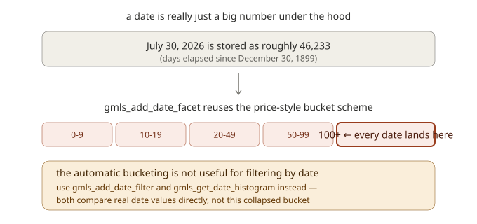
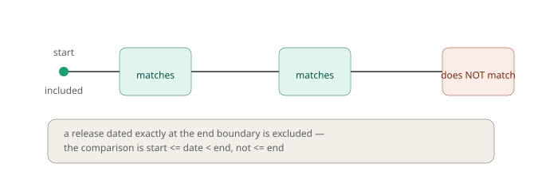
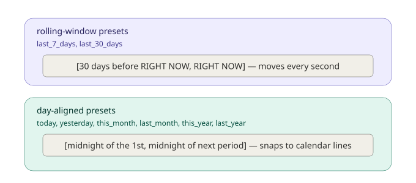
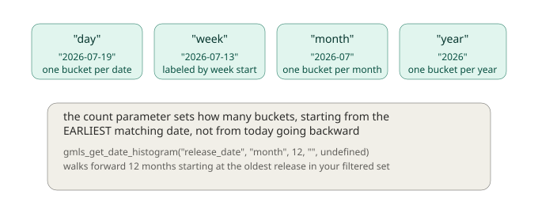

# Chapter 5: Working With Time — Date Facets and Time-Based Queries

"Show me what's new." "What released this month?" "Sort by most recent." If you've used more or less any storefront, content platform, or news feed, you've run into date-based filtering constantly — often without even registering it as a distinct feature, because it feels so natural. Of course you can see what's new. Of course there's a "recently added" section.

Under the hood, though, time-based filtering is genuinely trickier than filtering by category or platform, for a reason that's easy to overlook: **dates are continuous, not discrete.** "Category equals RPG" is a clean, exact match — a game either is an RPG or it isn't. But "released recently" has no single, universally correct definition. Recent compared to what? Does "this month" mean the last 30 days, or specifically the calendar month we're currently in — which could be anywhere from 1 to 31 days long depending on when someone asks? These aren't pedantic distinctions; they're exactly the kind of thing that produces subtly wrong behavior if you don't think about it carefully.

This chapter extends everything you learned about faceted search in Chapter 4 specifically into the date dimension. We'll cover date facets, filtering by explicit ranges and by convenient presets like "last 30 days," and building date histograms to visualize how a collection is distributed over time. And — being honest about the framework as it actually behaves, not as we might wish it behaved — we'll cover a real, worth-knowing limitation in how date facets interact with GMLiteSearch's automatic bucketing, so you don't stumble into confusing behavior later.

## Extending our marketplace with release dates

Rather than invent a new dataset, we're extending the same 75-game marketplace from Chapter 4 — this is a deliberate choice, not an oversight. Date facets are a direct extension of faceted search, applied to the same kind of content, so continuing with the same games lets us focus entirely on what's new (the date mechanics) without also re-learning an unfamiliar catalog.

Each game now has a `release_date`, spread across roughly two and a half years, from early 2024 through the current date of our tutorial's timeline. The full updated dataset, including these dates, lives in `Chapter5_Dataset.gml`.

```gml
var games = chapter5_get_games();  // same 75 games, now with release_date included

gmls_init();

for (var i = 0; i < array_length(games); i++) {
    var g = games[i];
    var facets = { category: g.category, tags: g.tags, platform: g.platform, price: g.price };
    var metadata = { title: g.name, tags: g.tags, timestamp: current_time };
    gmls_add_document_faceted(g.id, g.desc, facets, metadata);
    gmls_add_date_facet(g.id, "release_date", g.release_date);
}
```

Notice `gmls_add_date_facet` is a separate call from `gmls_add_document_faceted` — dates get their own dedicated indexing step, which we'll unpack shortly.

## Indexing a date: `gmls_add_date_facet`

```gml
gmls_add_date_facet(doc_id, facet_name, datetime);
```

This takes a document ID, a name for this date facet (you could have several — `release_date`, `last_updated_date`, whatever makes sense), and an actual GML datetime value, produced with `date_create_datetime(year, month, day, hour, minute, second)` — GML doesn't have a separate date-only constructor, so passing `0, 0, 0` for the time components gives you midnight on that date.

```gml
gmls_add_date_facet("gm_001", "release_date", date_create_datetime(2026, 7, 19, 0, 0, 0));
```

## An honest limitation worth understanding before you rely on this

Here's something worth knowing clearly before you build anything real on top of date facets, because it's the kind of thing that could otherwise cause real confusion later.

Under the hood, GameMaker stores every date-time value as a single number: **the number of days that have passed since December 30, 1899** (with a fractional part representing the time of day, if any). July 30, 2026, for instance, is stored as roughly 46,233. This is a completely reasonable internal representation for a date system — but it has a real consequence for how `gmls_add_date_facet` behaves, because of something we learned back in Chapter 4.

Recall that range facets (the mechanism behind numeric filtering, like price) use a **fixed, automatic bucketing scheme**: `0-9`, `10-19`, `20-49`, `50-99`, `100+`. This scheme was designed with small numbers in mind — prices in the tens or hundreds of dollars. And here's the important part: **`gmls_add_date_facet` calls that exact same range-facet mechanism internally**, passing the raw date serial number straight through it.



Since any real-world date's serial number is already in the tens of thousands, **every single date you add — no matter how far apart in actual calendar time — lands in the same "100+" bucket.** A game released in 2024 and a game released in 2026 are, as far as this particular automatic bucketing is concerned, indistinguishable. This isn't a bug exactly — the mechanism is doing precisely what it's designed to do, it's just that the fixed bucket scheme wasn't designed with date-scale numbers in mind, and nothing adapts it for that case.

**The practical takeaway**: don't rely on the automatic bucketing behind `gmls_add_date_facet` for actually filtering or grouping by date range. That's not what it's useful for. Instead, use the two purpose-built tools this chapter is actually about: `gmls_add_date_filter` for range filtering, and `gmls_get_date_histogram` for grouping and visualization — both of which we're about to cover, and both of which work directly with real date comparisons rather than this collapsed bucket scheme.

## Filtering by an explicit date range

The most direct way to filter by date is to specify a start and end datetime yourself:

```gml
gmls_clear_facet_filters();
gmls_add_date_filter("release_date", date_create_datetime(2024, 1, 1, 0, 0, 0), date_create_datetime(2025, 1, 1, 0, 0, 0));

var results = gmls_search_faceted("", -1, undefined);
show_debug_message("Games released in 2024: " + string(results.total));
```

This registers an active date filter the same way `gmls_add_facet_filter` registers a regular one — it plugs into the exact same `gmls_search_faceted` call and combines with any other active filters exactly as you'd expect.

### The boundary is precise: inclusive start, exclusive end

Worth stating explicitly, since getting a boundary wrong by even one day is a classic, easy-to-miss bug: **a date range matches any date that is greater than or equal to the start, and strictly less than the end.**



This is why our example above uses `date_create_datetime(2025, 1, 1, 0, 0, 0)` as the end boundary to mean "through the end of 2024" — a game released exactly on January 1st, 2025 at midnight would **not** be included, since the comparison is strictly less-than at the end. If you wanted to include all of 2024 and reasoned "end equals December 31, 2024," you'd actually be excluding anything released on December 31st itself (since `date_create_datetime(2024, 12, 31, 0, 0, 0)` represents the very start of that day — midnight — not its end). Using the *start* of the *following* period as your end boundary is the reliable, foolproof pattern, and it's exactly what GMLiteSearch's own built-in presets do internally, as we're about to see.

A quick note on the function itself: GML doesn't have a separate "date-only" constructor — `date_create_datetime(year, month, day, hour, minute, second)` is the actual function for building any specific point in time, date or otherwise. Passing zeros for the hour, minute, and second gives you midnight on that date, which is exactly what you want for date-range boundaries like these.

## Convenient presets

Writing out explicit date ranges works, but for extremely common queries — "what's new," "released this month" — GMLiteSearch offers named presets you can pass directly as a string instead of a datetime:

```gml
gmls_add_date_filter("release_date", "last_30_days");
```

The available presets are: `"today"`, `"yesterday"`, `"last_7_days"`, `"last_30_days"`, `"this_month"`, `"last_month"`, `"this_year"`, `"last_year"`. Let's run the "last 30 days" one against our real dataset:

```gml
gmls_clear_facet_filters();
gmls_add_date_filter("release_date", "last_30_days");

var results = gmls_search_faceted("", -1, undefined);
show_debug_message("New in the last 30 days: " + string(results.total));
for (var i = 0; i < array_length(results.results); i++) {
    show_debug_message("  " + results.results[i].document.metadata.title);
}
```

Against our dataset, this correctly finds **4 games** — the handful we deliberately released within the last month for this chapter's demonstration.

### Not all presets are built the same way

Here's a genuinely useful distinction to understand, because it explains behavior you might otherwise find surprising. The presets fall into two different categories, based on how their boundaries are calculated:



**`"last_7_days"` and `"last_30_days"` are rolling windows** — their end boundary is *the exact current moment*, not midnight of today. If it's 3:47 PM when you run the query, the window is "3:47 PM thirty days ago, through 3:47 PM right now." Run the same query again five minutes later, and the window has shifted by five minutes too. This makes sense for their purpose — "recently released" is inherently a moving target, always relative to *now*.

**Every other preset — `"today"`, `"yesterday"`, `"this_month"`, `"last_month"`, `"this_year"`, `"last_year"` — snaps to day-aligned boundaries.** `"this_month"` doesn't mean "the last 30-ish days," it means "from midnight on the 1st of the current calendar month, through midnight on the 1st of next month" — a boundary that only changes once a month, at a clean calendar line, not continuously.

This matters practically: if you're building something like "browse by month" navigation, you want the day-aligned presets. If you're building a "just added" ticker, the rolling-window presets are the right fit. Using the wrong category for your use case won't necessarily error — it'll just produce boundaries that don't quite match what a user would expect.

### Removing a date filter

```gml
gmls_remove_date_filter("release_date");
```

This removes an active date filter by facet name — you don't need to specify which range, since only one date filter can be active per facet name at a time (adding a new one for the same facet name adds another entry rather than replacing, so if you want a clean single range, clear first or remove before re-adding).

## Combining date filters with everything else

Date filters plug into the exact same filtering system from Chapter 4 — including the AND/OR logic. Let's find recent, affordable RPGs:

```gml
gmls_clear_facet_filters();
gmls_add_facet_filter("category", "rpg");
gmls_add_date_filter("release_date", "this_year");
gmls_set_filter_operator("AND");

var results = gmls_search_faceted("", -1, undefined);
show_debug_message("RPGs released this year: " + string(results.total));
```

Against our dataset, this finds **9** games — every RPG released within the current calendar year. The date filter combines with the category filter exactly the way two regular facets would under the `"AND"` operator from Chapter 4: a game needs to satisfy both conditions to survive.

## Date histograms: visualizing distribution over time

Sometimes you don't want to filter to one range — you want to see the whole shape of how your collection is spread across time. That's what `gmls_get_date_histogram` is for:

```gml
var histogram = gmls_get_date_histogram("release_date", "month", 12, "", undefined);
var months = variable_struct_get_names(histogram);
for (var i = 0; i < array_length(months); i++) {
    show_debug_message(months[i] + ": " + string(histogram[$ months[i]]) + " releases");
}
```

The `interval` parameter (`"day"`, `"week"`, `"month"`, or `"year"`) controls the bucket size, and each interval produces a differently-formatted label:



Running this against our dataset with a 6-month window on the most recent activity shows something like:

```
2025-11: 2 releases
2025-12: 1 releases
2026-03: 1 releases
2026-04: 3 releases
2026-05: 1 releases
2026-07: 4 releases
```

(Notice 2026-01, 2026-02, and 2026-06 aren't listed — that's expected. Just like `gmls_get_facet_counts` from Chapter 4, empty buckets simply don't appear in the result at all, rather than showing up with a zero.)

### A genuinely important detail: where the histogram starts

Here's something worth understanding precisely, because it's easy to assume the opposite: **the histogram's buckets start from the *earliest* matching date in your filtered set, and walk forward — not from "today" and walk backward.** If you ask for a 12-month histogram (`count = 12`) but your data only spans 6 real months, you'll get 12 buckets total, but the last several will simply be empty (zero releases, and per the point above, likely not shown at all) — because the walk started at your oldest data point and kept going, not because it anchored itself to the present. If you specifically want "the last N months relative to today," you'll want to combine this with a date filter (like `"last_month"` repeated, or an explicit range) to first narrow your data to a relevant window before building the histogram — the histogram itself doesn't know or care what "today" is.

### Weekly histograms and the start of the week

One more detail worth being upfront about, in the interest of not overstating my own certainty: when using `"week"` as the interval, GMLiteSearch labels each bucket by the date of that week's **Monday** — every release within the same Monday-to-Sunday span gets grouped under that Monday's date. This is the framework's own stated intent, based on its internal logic. I'll be honest that I wasn't able to independently, fully confirm GameMaker's exact weekday-numbering behavior against official documentation while writing this chapter — if you're building something where the precise week-start boundary matters, it's worth a quick sanity check in your own project (add a document dated on a known Wednesday, run a weekly histogram, and confirm the bucket label lands on the Monday of that same week) before relying on it in production.

## What you've learned

- **Dates are continuous, not categorical** — which is why they need dedicated filtering tools rather than being treated like an ordinary facet value.
- **`gmls_add_date_facet`** indexes a date, but its automatic bucketing (inherited from the range-facet system) is not useful for actual date filtering, since real-world dates all collapse into the same bucket. Use it to index the date; use the dedicated filtering tools to actually query by it.
- **`gmls_add_date_filter`** supports both explicit datetime ranges and convenient named presets.
- **Date range matching is half-open**: inclusive of the start, exclusive of the end — using the start of the *next* period as your end boundary is the reliable pattern.
- **Presets fall into two categories**: rolling-window presets (`last_7_days`, `last_30_days`) that shift continuously relative to right now, and day-aligned presets (`today`, `this_month`, `this_year`, and similar) that snap to fixed calendar boundaries.
- **Date filters combine with everything from Chapter 4** — including regular facets and the AND/OR operator — in the same `gmls_search_faceted` call.
- **`gmls_get_date_histogram`** groups documents into day, week, month, or year buckets, starting from the earliest matching date and walking forward — not anchored to the present moment.

## What's next

We've now covered filtering by category, tags, platform, price, and time — everything a player might want to narrow down *before* they even search for something specific. But there's an entirely different kind of "where" that we haven't touched at all: physical location. A player exploring an open world might want to know "what's near me" — not in a filtering sense, but in a genuinely spatial one, involving real distance calculations.

In **Chapter 6**, we're moving into **geospatial search** — a meaningfully different category of capability from anything covered so far. We'll cover both real-world coordinates (latitude and longitude, the kind you'd use for a location-based mobile game) and game-world coordinates (arbitrary x/y/z units, the kind you'd use for NPCs and points of interest in an open world), and we'll dig into why these two coordinate systems need genuinely different math under the hood.

See you there.
