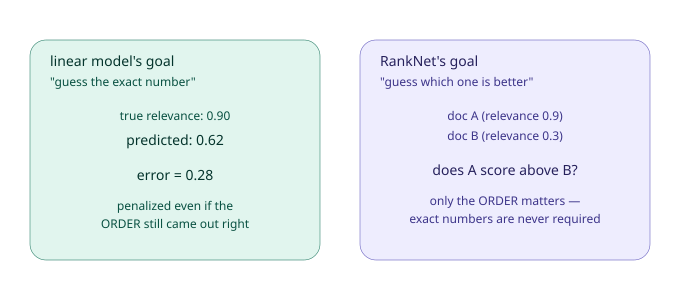
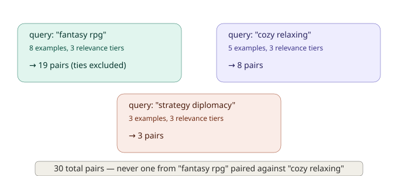
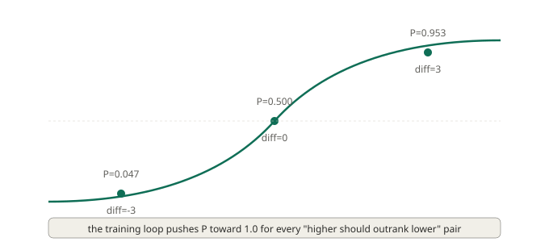
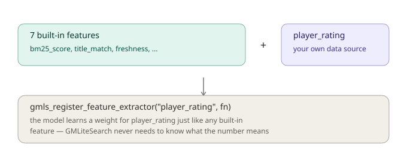

# Chapter 9: Beyond Regression, RankNet and Custom Signals

In Chapter 8, we trained our first ranking model, a linear combination of features, adjusted through gradient descent until its predictions got as close as possible to the relevance scores we told it were correct. That model works, and the concepts you learned there (features, weights, loss, gradient descent) are genuinely foundational to everything else in machine learning, not just this one narrow use case.

But there's a subtle mismatch worth examining honestly. The linear model's entire training process is built around one specific goal: **predict the exact relevance number as accurately as possible.** Search doesn't actually need that. Search needs a good *order*. And these two goals, while related, aren't identical, which means optimizing hard for one doesn't automatically get you the other for free.

This chapter introduces **RankNet**, a genuinely different learning approach that optimizes directly for the thing search actually cares about: getting the *order* right. We'll also cover **custom feature extractors**, a way to teach your model about signals specific to your own game that the 7 built-in features simply can't capture, since they don't know anything about your particular content.

## Why "predict the number" and "get the order right" aren't the same goal

Let's make this concrete with a genuinely illustrative scenario. Imagine two documents, A and B, for some query. The true relevance of A is 0.9, and the true relevance of B is 0.3, A should clearly outrank B.

Now suppose a model predicts A at 0.5 and B at 0.1. Both predictions are meaningfully *wrong* in an absolute sense, neither is close to its true value. But look at what actually matters for search: **A's prediction (0.5) is still higher than B's prediction (0.1)**. The order came out completely correct, even though every individual number was off.



The linear model from Chapter 8, trained with squared-error loss, would penalize this scenario heavily, both predictions are "wrong" by a meaningful margin, and the training loop would keep pushing to close that gap, even though, from a pure ranking-quality standpoint, there was nothing wrong with the result at all. This isn't a flaw in the linear model exactly, it's doing precisely what it was told to optimize for. It's just that "predict the exact number" and "get the order right" are genuinely different objectives, and a model built for one doesn't automatically excel at the other.

RankNet exists specifically to close this gap, by changing what the training loop actually optimizes for.

## The core idea: learn from comparisons, not absolute numbers

Instead of asking "how close was this prediction to the true relevance number?", RankNet asks a fundamentally different question: **"given two documents, did the model correctly predict which one should rank higher?"**

This changes everything about how training examples get used. Rather than treating each document as an independent prediction target, RankNet looks at **pairs** of documents that were both judged for the same query, and trains the model to push the higher-relevance document's score above the lower-relevance document's score, without ever requiring the exact gap between them to match any particular number.

### Building pairs from your training data

The training examples themselves are exactly the same ones you'd use for the linear model, `gmls_add_training_example(query, doc_id, relevance)`, unchanged from Chapter 8. What differs is entirely in how RankNet's training loop *uses* that data: instead of treating each example independently, it groups examples by query, then forms every possible pair within a group where the two examples have *different* relevance scores.



Using the same 16 training examples from Chapter 8, 8 for "fantasy rpg", 5 for "cozy relaxing", 3 for "strategy diplomacy", RankNet builds **30 total pairs**: 19 from the "fantasy rpg" group, 8 from "cozy relaxing", and 3 from "strategy diplomacy". Notice two things worth understanding precisely: pairs are only ever built *within* a single query's examples (a "fantasy rpg" document is never compared against a "cozy relaxing" document, that comparison wouldn't mean anything, since they're answering entirely different questions), and pairs with *identical* relevance scores are skipped entirely, since there's no meaningful "higher" or "lower" to learn from a tie.

### The sigmoid: turning a score difference into a probability

For each pair, RankNet computes both documents' current scores (using the same weighted-sum formula as the linear model, RankNet doesn't change *how* scoring works, only *how training decides what's correct*), then looks at the **difference** between them, and passes that difference through a mathematical function called a **sigmoid**:

```
probability = 1 / (1 + e^(-score_difference))
```

Here's the genuinely useful way to think about what this function does: it takes any number, positive, negative, huge, tiny, and squashes it into a value between 0 and 1, which can be interpreted as **"how confident is the model that the higher-relevance document actually scores above the lower one?"**



When the score difference is a large positive number (the model already scores the higher-relevance document well above the lower one), the sigmoid outputs something close to 1.0, high confidence, correctly so. When the difference is exactly 0 (the model currently scores them identically, expressing no preference), the sigmoid outputs exactly 0.5, genuine uncertainty. When the difference is negative (the model has the order backwards), the sigmoid outputs something close to 0, confidently wrong, which is exactly the situation training needs to correct hardest.

Training then does something intuitive: for every pair, it wants this probability to be as close to 1.0 as possible (since, by construction, the "higher" document in each pair genuinely *should* outrank the "lower" one), and it adjusts weights to push that probability upward, pair by pair, across your entire training set.

## Training a RankNet model

The actual GML is refreshingly familiar, since it follows the exact same shape as linear training:

```gml
gmls_set_ltr_model("ranknet");

var log = gmls_train_ranknet_model(iterations, learning_rate);
for (var i = 0; i < array_length(log); i++) {
    show_debug_message(log[i]);
}
```

```gml
var log = gmls_train_ranknet_model(100, 0.05);
```

Running this against our same 16 training examples from Chapter 8 produces something like:

```
RankNet: built 30 training pairs
Iteration 0 - Pairwise loss: 0.4380
Iteration 20 - Pairwise loss: 0.1033
Iteration 40 - Pairwise loss: 0.0674
Iteration 60 - Pairwise loss: 0.0537
Iteration 80 - Pairwise loss: 0.0465
Iteration 99 - Pairwise loss: 0.0422
RankNet training complete
```

Notice the loss here is called **"pairwise loss,"** not the plain "loss" from Chapter 8, a small naming difference reflecting a genuinely different underlying quantity being minimized. Chapter 8's loss was **squared error**: literally `(true_value - predicted_value)²`, penalizing the raw numeric gap between prediction and reality. RankNet's pairwise loss instead uses something called **cross-entropy**, a way of measuring loss that's specifically built for probabilities rather than raw numbers, recall that the sigmoid output we just covered *is* a probability (how confident the model is that the ordering is correct). Cross-entropy penalizes a confidently *wrong* probability far more harshly than a mildly wrong one, if the model was 95% sure of the wrong order, that's penalized much more severely than if it was only 55% sure. You don't need the underlying formula to work with RankNet effectively, but it's worth knowing the two losses aren't just named differently, they're built for genuinely different kinds of predictions (raw numbers vs. probabilities), which is exactly why Chapter 8's linear model and this chapter's RankNet needed different training math in the first place, not just a different label on the same math.

### Evaluating a RankNet model

Since RankNet's whole point is getting pairwise order right, its evaluation function measures exactly that, not MSE/MAE like the linear model:

```gml
var eval = gmls_evaluate_ranknet_model();
show_debug_message("Pairs tested: " + string(eval.pairs_tested));
show_debug_message("Correct: " + string(eval.correct));
show_debug_message("Accuracy: " + string(eval.accuracy));
```

```
Pairs tested: 30
Correct: 29
Accuracy: 0.9667
```

This is a genuinely intuitive metric: **out of every pair the model was trained on, what fraction did it end up scoring in the correct relative order?** 96.67% here means the trained model gets all but one of these 30 pairwise comparisons right, a strong, easily-interpreted result, in a way that raw MSE numbers from Chapter 8 arguably weren't quite as immediately meaningful.

### Comparing linear and RankNet directly

Since both models share the same underlying scoring formula (a weighted sum of features, RankNet only changes *how the weights get trained*, not how a trained model actually computes a score), you can train both on the same data and compare:

```gml
gmls_set_ltr_model("linear");
var linear_log = gmls_train_linear_model(200, 0.05);

gmls_set_ltr_model("ranknet");
var ranknet_log = gmls_train_ranknet_model(100, 0.05);

// compare their rankings on a real query
gmls_set_ltr_model("linear");
var linear_results = gmls_search_ltr("fantasy rpg", 5);

gmls_set_ltr_model("ranknet");
var ranknet_results = gmls_search_ltr("fantasy rpg", 5);
```

In practice, for training data with a genuinely clean, well-separated relevance structure (like our example), both approaches often converge to broadly similar final rankings, the real, practical difference tends to show up more clearly on messier, more ambiguous real-world data, where getting *exact* relevance numbers right is genuinely harder than just getting relative order right. RankNet's design gives it a structural advantage specifically in that harder, messier regime.

## Custom feature extractors: teaching the model about your own data

Everything so far has relied entirely on the 7 built-in features, BM25 score, term frequency, title match, and so on. These are genuinely useful, general-purpose signals, but they share one real limitation: **they only know about things GMLiteSearch can observe directly from your indexed text and metadata.** They have no way to know about a player rating you store elsewhere, a "featured" flag your game's backend sets, or a custom popularity metric from your own analytics system.

Custom feature extractors close this gap, letting you plug in your own numeric signals, computed however you like, and have the model learn a weight for them exactly the same way it learns weights for the built-in seven.



### A realistic example: player ratings

Let's say your marketplace tracks player ratings for each game, a `1.0` to `5.0` star rating, stored in your own data structure, completely separate from anything GMLiteSearch's document index knows about:

```gml
global.game_ratings = ds_map_create();
ds_map_add(global.game_ratings, "gm_001", 4.8);
ds_map_add(global.game_ratings, "gm_002", 4.3);
ds_map_add(global.game_ratings, "gm_073", 4.9);
// ... and so on for every game
```

To let your ranking model actually learn from this, you write an **extractor function**, a function with a specific expected signature, `(doc_id, query, search_result)`, that returns a single number:

```gml
function player_rating_extractor(_doc_id, _query, _search_result) {
    var _rating = 3.0; // sensible default for unrated games
    if (ds_map_exists(global.game_ratings, _doc_id)) {
        _rating = ds_map_find_value(global.game_ratings, _doc_id);
    }
    return _rating / 5.0; // normalize to roughly 0-1, consistent with the built-in features' scale
}

gmls_register_feature_extractor("player_rating", player_rating_extractor);
```

Notice we normalized the raw 1-5 rating down to roughly a 0-1 range before returning it. This isn't strictly required, the model can technically learn a weight for a feature at any scale, but keeping custom features on a similar numeric scale to the built-in ones tends to make training behave more predictably, since wildly different scales between features can make gradient descent's step sizes work better for some features than others.

### What registration actually does

`gmls_register_feature_extractor` does two things worth knowing precisely: it stores your function so it gets called automatically during feature extraction going forward, and it **automatically assigns your new feature a starting weight of `0.5`**, the same default the built-in features get, ensuring it's genuinely eligible to be trained rather than silently ignored.

```gml
var stats = gmls_get_ltr_stats();
show_debug_message("player_rating weight: " + string(stats.feature_weights[$ "player_rating"]));
// prints: player_rating weight: 0.5 (before any training)
```

### Training with a custom feature in place

Once registered, your custom feature participates in training exactly like any built-in one, no special training call, no separate step. Just train normally:

```gml
gmls_set_ltr_model("linear");
var log = gmls_train_linear_model(200, 0.05);
```

Every training example computed from this point forward will automatically include `player_rating` in its feature vector, and gradient descent will find an appropriate weight for it, right alongside `bm25_score`, `title_match`, and the rest.

### Safety: what happens if your extractor breaks?

Real code sometimes fails, maybe the data structure your extractor depends on isn't populated yet, maybe there's a typo, maybe you're accessing something that doesn't exist for a particular document. GMLiteSearch handles this defensively, and it's worth knowing exactly how:

```gml
function broken_extractor(_doc_id, _query, _search_result) {
    return _search_result.this_field_does_not_exist.nested_access; // will throw
}
gmls_register_feature_extractor("broken_feature", broken_extractor);
```

If this extractor throws an error during feature extraction, GMLiteSearch **catches it, silently skips that one feature for that one document, and continues processing everything else normally**, it does not crash the search, and it does not stop other features (built-in or custom) from being computed correctly. The same graceful handling applies if your extractor runs successfully but returns something that isn't a number (a string, a struct, `undefined`), that value is simply not included, rather than corrupting the feature vector or crashing anything downstream.

This matters practically: you can experiment with custom extractors during development without worrying that one bug will take down your entire search pipeline. It fails safe, one feature at a time.

## What you've learned

- **Predicting an exact number and getting the order right are genuinely different goals**, a model heavily penalized for absolute prediction error can still have gotten every meaningful ranking decision correct.
- **RankNet learns from pairs**, not individual absolute predictions, grouping training examples by query, and training only on pairs where relevance genuinely differs.
- **The sigmoid function** converts a raw score difference into an interpretable probability (0 to 1) representing how confidently the model believes the ordering is correct.
- **RankNet and linear share the same scoring formula**, a weighted sum of features, differing only in *how* the weights get trained, which is why you can meaningfully compare them on identical data.
- **`gmls_evaluate_ranknet_model`** reports pairwise accuracy directly, an intuitive, easily-interpreted metric distinct from the linear model's MSE/MAE.
- **Custom feature extractors** let you incorporate any numeric signal your game tracks, player ratings, custom popularity metrics, anything, directly into the same learned-weight framework as the built-in features.
- **Registering an extractor auto-assigns a default weight**, and normalizing your custom feature to a similar scale as the built-ins tends to help training behave predictably.
- **Broken or misbehaving extractors fail safely**, one feature gets silently skipped, without affecting the rest of the search pipeline.

## What's next

Both models we've built so far, linear and RankNet, share a real structural limitation: they can only express relationships between features as a simple weighted sum. But what if the *true* relationship is more complicated? What if "high BM25 score" only really matters *when combined with* "high title match," but neither one alone is a strong signal? A weighted sum genuinely can't represent that kind of interaction, no matter how you tune the weights.

**Chapter 10**, the final chapter in this series, introduces **LambdaMART**, a fundamentally more powerful approach built on **decision trees** and **gradient boosting**, capable of learning exactly these kinds of feature interactions. It's also, honestly, the single most conceptually demanding chapter in this whole tutorial, we'll build up decision trees from a simple, plain-language example before any code, then boosting, then the NDCG metric that makes LambdaMART specifically suited to ranking. We'll close with a tour of GMLiteSearch's developer tools, for debugging and validating a real production search deployment.

See you there.
